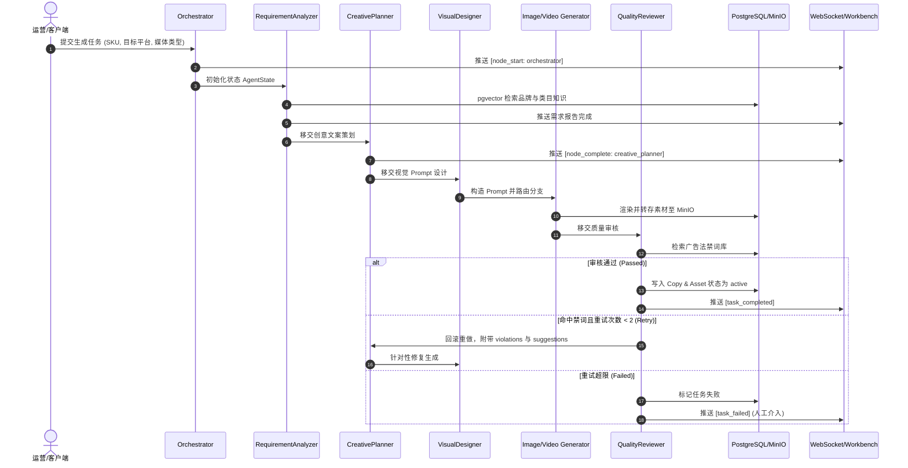

# 智能体工作流执行与调试技能 (Agent Workflow Runner)

## 1. 核心流程拓扑 (P-E-V 闭环)



---

## 2. CLI 调试指令与标准输出
开发者或测试人员可使用专用 CLI 脚本直接运行任意 SKU 的生成流程：

```bash
# 激活虚拟环境后运行
python run_workflow.py --sku-id <SKU_UUID> --media-type mixed --platform amazon
```

期望指标输出：
- `total_elapsed_ms`: 总耗时 (ms)
- `node_runs`: 各节点耗时、Token 消耗、输入输出快照
- `compliance_score`: 最终合规打分
- `violations`: 命中违禁词列表 (若有)
