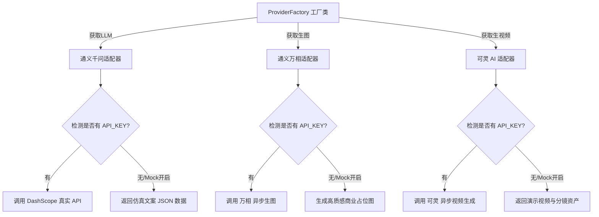

# 模型厂商集成与调试技能 (Model Provider Integrator)

## 1. 技能定位与核心职责
为电商内容生成中台提供统一的模型厂商适配标准，解耦业务逻辑与具体模型底层接口，支持生产环境真实 API 调用与开发测试环境 Mock 数据的无缝切换。

---

## 2. 官方接口规范与调用指引

### A. 阿里通义千问 (Qwen-Plus / Qwen-Max) — 文本与结构化生成
- **官方文档**：[阿里云百炼 / DashScope 开发文档](https://help.aliyun.com/zh/model-studio/developer-reference/)
- **API 端点**：`https://dashscope.aliyuncs.com/compatible-mode/v1/chat/completions` (OpenAI 兼容模式) 或 原生 SDK
- **鉴权方式**：`Authorization: Bearer <DASHSCOPE_API_KEY>`
- **请求格式**：
  ```json
  {
    "model": "qwen-plus",
    "messages": [
      {"role": "system", "content": "You are a professional ecommerce copywriter..."},
      {"role": "user", "content": "Generate 5 bullet points for SKU..."}
    ],
    "response_format": {"type": "json_object"},
    "temperature": 0.7
  }
  ```

### B. 阿里通义万相 (Wanx 2.1) — 电商高质量生图
- **官方文档**：[通义万相图像生成 API 文档](https://help.aliyun.com/zh/model-studio/developer-reference/tongyi-wanxiang-api)
- **API 端点**：`https://dashscope.aliyuncs.com/api/v1/services/aigc/text2image/image-synthesis`
- **调用流程**：
  1. POST 提交异步任务，获取 `task_id`；
  2. GET `https://dashscope.aliyuncs.com/api/v1/tasks/{task_id}` 轮询渲染状态；
  3. 状态变为 `SUCCEEDED` 后，从 `results[].url` 提取图片链接，下载并转存至本地 MinIO。

### C. 快手可灵 (Kling AI) — 电商短视频生成
- **官方文档**：[快手可灵 AI 开发者平台](https://klingai.kuaishou.com/)
- **API 端点**：`https://api.klingai.com/v1/videos/text2video` 或 `image2video`
- **鉴权方式**：基于 AK/SK 签发的 JWT Token
- **请求格式**：
  ```json
  {
    "model": "kling-v1",
    "prompt": "4K cinematic product showcase, soundproof headphones on marble desk...",
    "aspect_ratio": "9:16",
    "duration": 5
  }
  ```

---

## 3. 架构适配器模式 (Provider Factory)



---

## 4. 调试与验证准则
1. **真实密钥接入**：只需在根目录 `.env` 或 `conf/.env.example` 中填入对应 API Key，重启服务即生效。
2. **断网与未配置防御**：未配置 Key 时系统必须优雅降级至 Mock 模式，且在日志中输出 WARN 提示，严禁抛出未捕获的崩溃异常。
