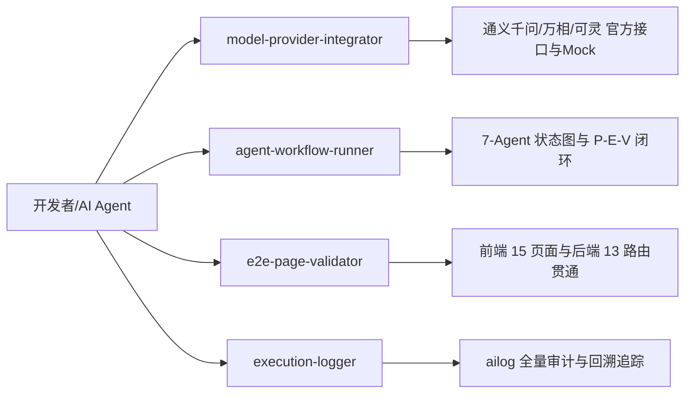

# AI 执行日志：通用 Skills 体系搭建完成

- **执行时间**：2026-09-24 00:58:00 (CST)
- **对话编号**：aac3b6ee-da00-4554-8fcc-ab783e817542
- **执行模型**：Gemini 3.8 Flash (High)
- **触发类型**：用户阶段指令

---

## 一、用户需求与背景
用户指令：
> “首先你先创建几个通用的skill，这样方便后续能分别电动，然后再开始写完整代码”

背景分析：
在启动大规模全栈代码编写前，需要先沉淀通用的 Agent/架构技能资产，支持模块化的模型对接、工作流调试与全页面验收。

---

## 二、架构设计与技能拓扑

---

## 三、具体执行操作清单

### 1. 新建 Skill 清单 (双向兼容部署)
1. **`model-provider-integrator`**：
   - `.agents/skills/model-provider-integrator/SKILL.md`
   - `.claude/skills/model-provider-integrator/SKILL.md`
   - 内容：通义千问、通义万相、快手可灵官方 API 契约、鉴权机制、输入输出 Payload 与 Mock 降级策略。
2. **`agent-workflow-runner`**：
   - `.agents/skills/agent-workflow-runner/SKILL.md`
   - `.claude/skills/agent-workflow-runner/SKILL.md`
   - 内容：7-Agent LangGraph 状态图执行规范、P-E-V 循环时序图与 CLI 运行指令。
3. **`e2e-page-validator`**：
   - `.agents/skills/e2e-page-validator/SKILL.md`
   - `.claude/skills/e2e-page-validator/SKILL.md`
   - 内容：15 个核心前端页面路由与后端 API 的映射验收矩阵。

---

## 四、执行结果与下一步计划
- 技能库已全部创建就绪，可被系统动态调用。
- 下一步：建立 Python 虚拟环境（`uv venv`），配置防冲突 Docker 基础设施并编写第三方模型接入官方规范文档。
