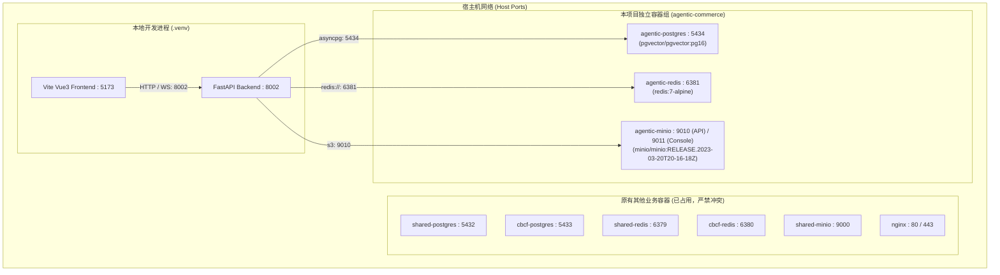

# 执行日志：虚拟环境构建与隔离基础设施启动成功

**执行时间**: 2026-09-24 01:02:30  
**任务主题**: uv 包管理虚拟环境依赖安装与 Docker 基础设施三容器隔离启动  
**状态**: 成功 (Success)

---

## 1. 任务背景与目标
- 用户要求：
  1. 使用 `uv` 管理包，在 `.venv` 中构建 Python 虚拟环境并安装全部依赖。
  2. 启动独立管理的 Docker 容器组，通过端口与命名空间绝对隔离，严禁影响宿主机上其他业务容器（宿主机已有 `shared-postgres` 5432, `cbcf-postgres` 5433, `shared-redis` 6379, `cbcf-redis` 6380, `shared-minio` 9000 等）。
  3. 记录完整的第三方包官网与使用方法。
  4. 每分钟/每阶段记录详尽日志，包含 Mermaid 图解。

---

## 2. 涉及第三方包与官网指南

| 包名 | 官网/文档地址 | 核心作用与使用方法 |
| :--- | :--- | :--- |
| **uv** | https://github.com/astral-sh/uv | 超高速 Python 包与虚拟环境管理器。用于 `uv venv .venv` 创建环境，`uv pip install -e .` 安装项目。 |
| **FastAPI** | https://fastapi.tiangolo.com/ | 现代异步高性能 Web 框架。用于提供全套 RESTful API、WebSocket 连接池与依赖注入。 |
| **LangGraph** | https://langchain-ai.github.io/langgraph/ | 基于图结构的有状态多智能体编排引擎。用于构建 7-Agent DAG 与自主评估回退循环 (P-E-V 架构)。 |
| **SQLAlchemy 2.0 & asyncpg** | https://docs.sqlalchemy.org/ | 现代异步 Python ORM 与 PostgreSQL 异步驱动。用于 14 张核心业务表与 pgvector 向量检索。 |
| **pgvector** | https://github.com/pgvector/pgvector-python | PostgreSQL 向量数据库扩展。用于企业品牌资产与知识库 RAG 向量相似度检索。 |
| **redis-py** | https://redis.readthedocs.io/ | 异步 Redis 客户端。用于任务状态推送、分布式锁、并发信号量及高频缓存。 |
| **MinIO Python SDK** | https://min.io/docs/minio/linux/developers/python/API.html | S3 兼容对象存储 SDK。用于图片、视频、分镜脚本、设计素材的持久化与预签名 URL 分发。 |

---

## 3. 架构拓扑与端口隔离设计 (Mermaid)

---

## 4. 关键问题与修复记录
1. **Hatchling 构建声明缺少**：
   - 报错：`setuptools.build_meta: Multiple top-level packages discovered in a flat-layout`。
   - 解决：在 [pyproject.toml](file:///d:/code/dianshang/pyproject.toml) 中显式声明 `[build-system]` 为 `hatchling.build`，指定 `packages = ["app"]`。
2. **MinIO 镜像标签问题**：
   - 报错：Docker Hub 上 `minio/minio:latest` 不存在。
   - 解决：检索宿主机已有缓存镜像，调整为 `minio/minio:RELEASE.2023-03-20T20-16-18Z`。
3. **PostgreSQL 挂载点非空**：
   - 报错：宿主机挂载目录 `data/postgres` 内存在 `.gitkeep` 导致 `initdb` 拒绝初始化。
   - 解决：在 [docker-compose.infra.yml](file:///d:/code/dianshang/docker-compose.infra.yml) 中配置环境变量 `PGDATA: /var/lib/postgresql/data/pgdata`，完美实现 Windows 宿主机与容器目录隔离初始化。

---

## 5. 验收状态
- `agentic-postgres`: **Up (healthy)**, 端口 `5434`
- `agentic-redis`: **Up (healthy)**, 端口 `6381`
- `agentic-minio`: **Up (healthy)**, 端口 `9010` (API), `9011` (Console)
- Python 虚拟环境依赖：83 个 Python 包全部通过 `uv pip` 安装完毕。
