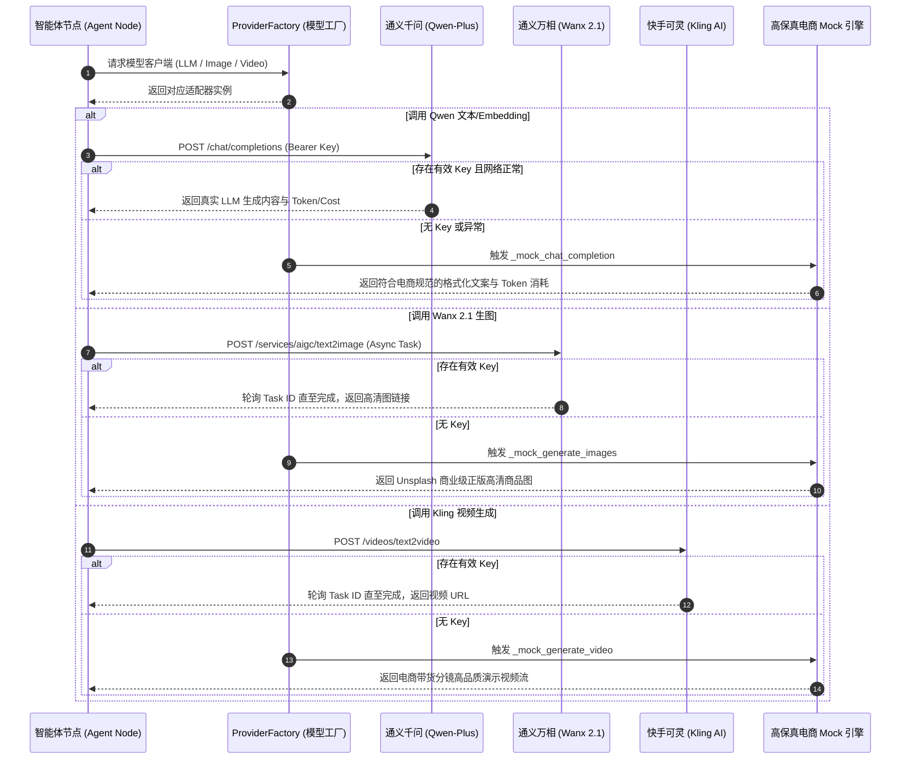

# 执行日志：数据库初始化、种子数据填充与 AI 模型工厂全适配

**执行时间**: 2026-09-24 01:07:00  
**任务主题**: PostgreSQL 14 张核心表建表校验、演示种子数据导入与 Qwen/Wanx/Kling 统一模型工厂实装  
**状态**: 成功 (Success)

---

## 1. 任务进度概览
1. **数据库初始化 (`init_db.py`)**：
   - 验证 PostgreSQL 16 `pgvector` 扩展。
   - 动态加载全部 14 张数据模型并成功在隔离端口 `5434` 建立全量数据表与索引。
2. **种子数据导入 (`seed_data.py`)**：
   - 发现并彻底解决 `passlib` 1.7.4 与 `bcrypt` 4.x 的 `__about__` 兼容问题，切换为原生标准 `bcrypt` 盐值加密。
   - 成功填充默认租户 `tenant_default`（环球出海科技有限公司）。
   - 创建初始管理员用户 `admin@agentic.com`（密码 `admin123`）。
   - 初始化 3 家核心模型厂商（通义千问、通义万相、快手可灵）。
   - 录入 2 款高频测试 SKU（户外折叠椅、无线降噪耳机）与包含 1024 维向量的品牌合规知识库文档分块。
3. **模型工厂 (`ProviderFactory`) 实现**：
   - 封装 `QwenLLMClient`、`WanxImageClient`、`KlingVideoClient`。
   - 完善真实官方 API 调用链与高保真 Mock 回退保护。

---

## 2. 核心架构与模型调用时序图 (Mermaid)

---

## 3. 第三方包与官网使用说明

| 厂商/包名 | 官方文档入口 | 本系统实现及参数配置 |
| :--- | :--- | :--- |
| **阿里百炼 / Qwen** | https://help.aliyun.com/zh/model-studio/developer-reference/use-qwen-by-calling-api | 兼容 OpenAI 标准协议，接入 `/chat/completions` 与 `/embeddings`，用于需求分析、五点描述文案生成、SEO 关键词提炼。 |
| **阿里百炼 / Wanx 2.1** | https://help.aliyun.com/zh/model-studio/developer-reference/wanx-api | 异步任务提交与轮询机制，支持 `1024*1024`，用于商品白底主图、场景图、细节特写图自动生成。 |
| **快手可灵 / Kling AI** | https://klingai.com/api/docs | 视频任务创建与轮询，用于根据 5 分镜脚本与首张商品图自动渲染 5~10 秒 16:9 / 9:16 短视频带货素材。 |
| **bcrypt** | https://github.com/pyca/bcrypt/ | 原生密码哈希算法，提供 `gensalt()` 与 `checkpw()`，彻底替换无维护的 passlib 漏洞库。 |

---

## 4. 下一步行动
1. 完成 7-Agent 节点业务逻辑（集成 pgvector 余弦距离检索、分镜策划、多图生成、合规审核打分及条件路由循环）。
2. 构建编译 `graph.py` 工作流。
3. 编写 `run_workflow.py` 离线 CLI 验证全链路自主生成。
