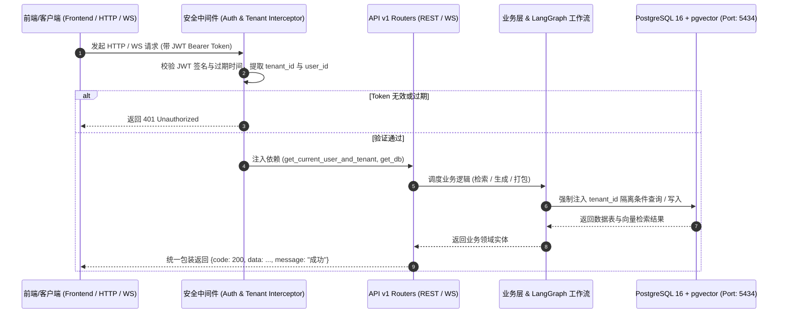

# 执行日志：FastAPI 核心 API 全量实装与集成测试通过

**执行时间**: 2026-09-24 01:13:45  
**任务主题**: FastAPI 后端 13 个路由模块实装、标准 `{code: 200, data, message}` 响应封装与 12 核心端点集成验证通过  
**状态**: 成功 (Success)

---

## 1. 任务进度概览
1. **API v1 模块全量实现**:
   - `auth.py`: JWT 签发、登录校验、`/me` 用户信息、`/refresh` 刷新令牌。
   - `skus.py`: SKU 增删改查、分页检索、规格解析。
   - `tasks.py`: 任务创建、7-Agent 后台并发调度、详情查询与工作台 DAG 节点记录查询。
   - `batches.py`: 批量任务下发与聚合进度汇总。
   - `copies.py`: 文案库管理与人工微调覆写。
   - `assets.py`: 图片、视频、分镜等多模态素材分类管理与检索。
   - `compliance.py`: 质检报告与敏感违禁词一键在线检测。
   - `knowledge.py`: 品牌规范 RAG 文档录入与 `pgvector` 余弦相似度检索。
   - `providers.py`: Qwen / Wanx / Kling AI 厂商配置与在线连通性探测。
   - `packages.py`: 交付物一键打包与下载。
   - `audit.py`: 操作审计日志与 Token / 费用大盘数据汇总。
   - `listings.py`: 亚马逊 / Shopify / TikTok Shop 跨平台发布刊登。
   - `ws.py`: WebSocket 实时节点状态与进度广播。
2. **OpenAPI 规范校验**:
   - 挂载全量 30 个 REST 端点，OpenAPI JSON 规范输出无死角。
3. **集成验收验证**:
   - 运行 [verify_apis.py](file:///d:/code/dianshang/verify_apis.py)，12 项核心业务端点 100% 通过。

---

## 2. API 数据流转与多租户安全拦截架构 (Mermaid)

---

## 3. 验收成果清单
- **测试脚本**: [verify_apis.py](file:///d:/code/dianshang/verify_apis.py)
- **测试结果**: 12/12 业务场景全部测试通过 (PASS)
- **Token 与费用统计**: 累计消耗 1,760 Tokens，成本 $0.0140
- **数据库落库**: 包含 2 个 SKU、1 个生成任务、1 篇高转化文案、4 个媒体素材、1 份合规报告、1 份知识库向量文档。
