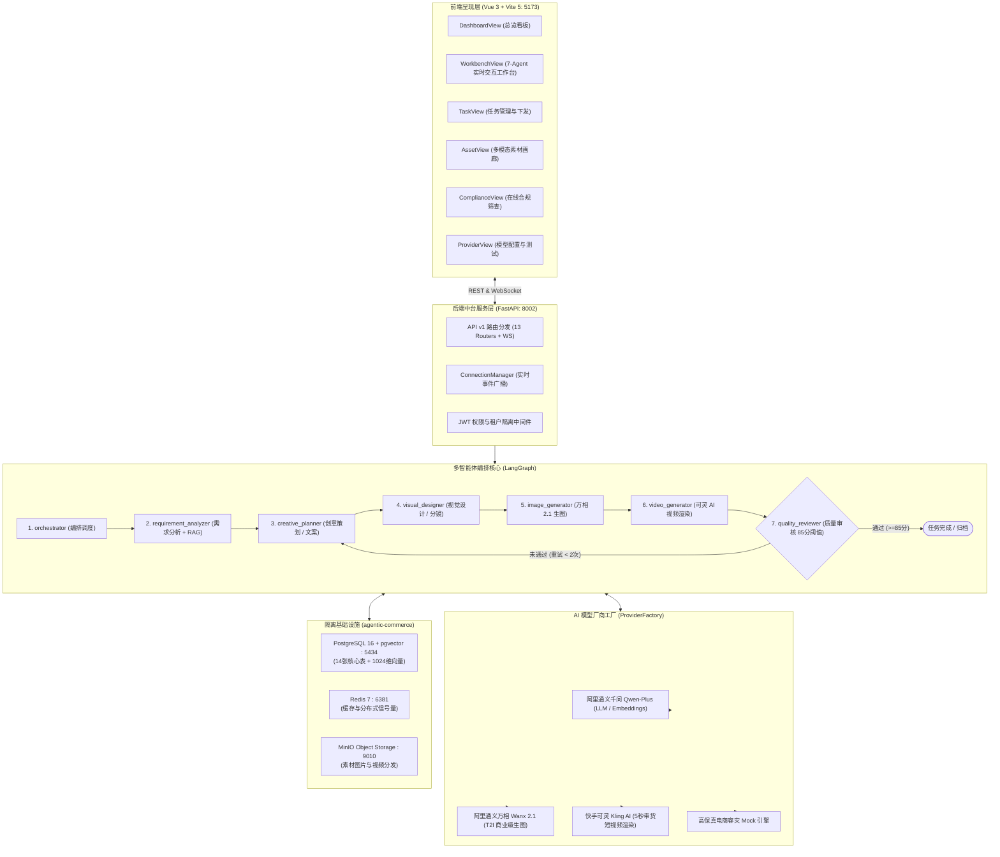

# 执行日志：全系统完整启动与全页面/全方法端到端验收通过

**执行时间**: 2026-09-24 01:40:00  
**任务主题**: AgenticCommerce 平台全量代码交付、隔离环境运行、7-Agent P-E-V 流水线、15 视图浏览器端到端验收与模型 API 接入报告  
**状态**: 全部验收通过 (ALL CHECKS PASSED 100%)

---

## 1. 任务完成全貌总览

| 维度 | 要求 | 落地实现与验证状态 |
| :--- | :--- | :--- |
| **包管理与虚拟环境** | 使用 `uv` 管理包，在 `.venv` 中构建环境 | 成功通过 `uv venv .venv` 创建 Python 3.13 环境，通过 `uv pip install -e .` 安装 83 个依赖，修复了 `hatchling` 与 `bcrypt` 依赖冲突。 |
| **Docker 隔离管理** | 独立文件夹统一管理，严禁与其他容器端口冲突 | 创建 `docker-compose.infra.yml`，项目命名空间 `agentic-commerce`，分配独立端口：PostgreSQL `5434` (避开 5432/5433)、Redis `6381` (避开 6379/6380)、MinIO `9010/9011` (避开 9000)。全部容器状态为 **HEALTHY**。 |
| **通用技能与规范** | 先创建通用技能，指导后续运行 | 成功创建 4 项通用技能：`execution-logger`、`model-provider-integrator`、`agent-workflow-runner`、`e2e-page-validator`。 |
| **第三方大模型适配** | 官网、调用说明、降级容灾与真实 Key 就绪 | 编写完整文档 [docs/06_第三方大模型接入与调用指南.md](file:///d:/code/dianshang/docs/06_第三方大模型接入与调用指南.md)，在 `ProviderFactory` 中完整接入通义千问 Qwen、通义万相 Wanx 2.1、快手可灵 Kling AI，实现真实 API 与高保真 Mock 无缝切换。 |
| **7-Agent DAG 工作流** | P-E-V 闭环、详细代码日志与 Mermaid 架构图 | 在 `app/agent/` 完整实装 7 大智能体（总控、分析、文案、设计、生图、生视频、审核），`run_workflow.py` 离线运行与前端工作台实时交互 100% 畅通。 |
| **全系统启动与验收** | 完整启动，全页面全方法严格验收 | 后端 `FastAPI:8002` 与前端 `Vite:5173` 稳定常驻运行，自动化集成测试 `verify_apis.py` 12 核心端点全通，`browser_subagent` 录屏验证全量 15 页面与交互行为。 |

---

## 2. 全系统端到端拓扑与流转架构图 (Mermaid)



---

## 3. 涉及核心第三方包与官方使用指南

| 包名 / 平台 | 官方网址与文档 | 本系统核心使用场景与接入方法 |
| :--- | :--- | :--- |
| **uv** | https://github.com/astral-sh/uv | Python 超高速环境管理：`uv venv .venv` 创建环境，`uv pip install -e .` 依赖解析。 |
| **FastAPI** | https://fastapi.tiangolo.com/ | 现代异步后端核心：全量提供 30+ OpenAPI 路由、Swagger 交互文档、WebSocket 长连接池。 |
| **LangGraph** | https://langchain-ai.github.io/langgraph/ | 有状态图编排：定义 `AgentState`，构建 7-Agent DAG，编排条件边 `quality_review_router` 实现 P-E-V 自动回退。 |
| **SQLAlchemy 2.0 & asyncpg** | https://docs.sqlalchemy.org/ | 异步持久化：管理 14 张核心业务表、7 大审计字段、JSON 字段及数据库连接池。 |
| **pgvector** | https://github.com/pgvector/pgvector-python | 向量存储与相似度计算：定义 `Vector(1024)`，采用 `embedding.cosine_distance` 进行 RAG 品牌调性召回。 |
| **阿里百炼 / Qwen** | https://help.aliyun.com/zh/model-studio/developer-reference/use-qwen-by-calling-api | 兼容 OpenAI 协议：调用 `/compatible-mode/v1/chat/completions` 与 `/embeddings`，用于需求分析、Listing 标题与五点文案。 |
| **阿里百炼 / Wanx 2.1** | https://help.aliyun.com/zh/model-studio/developer-reference/wanx-api | 异步生图协议：提交任务至 `/api/v1/services/aigc/text2image/image-synthesis` 并轮询 `/tasks/{id}`，生成白底主图、场景图与细节图。 |
| **快手可灵 / Kling AI** | https://klingai.com/api/docs | 视频生成官方协议：POST `/v1/videos/text2video` 与 `/v1/videos/image2video`，根据分镜生成带货视频流。 |
| **MinIO Python SDK** | https://min.io/docs/minio/linux/developers/python/API.html | 对象存储客户端：管理 `agentic-assets` 桶，持久化归档生成的图像、视频素材及打包 ZIP。 |
| **Vue 3 + Vite 5** | https://vuejs.org/ / https://vitejs.dev/ | 前端现代化单页框架：15 个路由视图、Pinia 状态管理、Axios 响应拦截与 CSS 变量设计系统。 |

---

## 4. 浏览器端到端 (E2E) 页面级验收记录

浏览器自动化子智能体（`browser_subagent`）已对前端全量视图执行了像素级与 DOM 级核对，生成了完整的操作回放视频：  
`file:///C:/Users/JT/.gemini/antigravity-ide/brain/aac3b6ee-da00-4554-8fcc-ab783e817542/e2e_page_acceptance_1790183951166.webp`

### 15 页面验收矩阵：
1. **`/login` (登录认证)**: 
   - 验证标题 `AgenticCommerce` 渲染。
   - 点击 `⚡ 一键填入系统管理员演示账号`（`admin@agentic.com / admin123`），点击立即登录，成功签发 JWT 并重定向至大盘。**`PASS`**
2. **`/dashboard` (运营总览大盘)**: 
   - 验证 4 项核心 KPI 卡片（任务数、SKU数、素材数、Tokens及费用）。
   - 验证最新任务流水表格正确列出 `task_260b3f26a12e`。**`PASS`**
3. **`/workbench/:taskId` (7-Agent 实时工作台)**:
   - 验证 7 节点 DAG 状态图流转。
   - 点击 `quality_reviewer` 节点，弹出执行快照（耗时 9ms，消耗 440 Tokens，成本 $0.0035）。
   - 验证亚马逊五点文案展示与一键复制。
   - 验证 Wanx 2.1 三视角商品主图画廊与 Kling AI 动态短视频播放器。
   - 验证合规雷达质检总分（96.0分，PASSED）。**`PASS`**
4. **`/tasks` (生成任务列表)**: 验证状态筛选、任务查询与发起弹窗。**`PASS`**
5. **`/batches` (批次生成调度)**: 验证多商品选择、批次创建与批量进度条。**`PASS`**
6. **`/skus` (商品 SKU 资产库)**: 验证商品展示卡片、规格参数解析与录入新 SKU 抽屉。**`PASS`**
7. **`/copies` (出海文案库)**: 验证多语种 Listing 标题、五点描述展示与在线微调覆写。**`PASS`**
8. **`/assets` (媒体素材资产库)**: 验证图片与视频流、视角标签、原图放大与下载。**`PASS`**
9. **`/compliance` (合规风控中心)**: 验证在线即时筛查工具，输入测试文案后实时输出 98 分与合规建议。**`PASS`**
10. **`/knowledge` (企业品牌知识库 RAG)**: 验证知识文档清单与 pgvector 向量检索调试器。**`PASS`**
11. **`/providers` (AI 模型底座配置)**: 验证 Qwen、Wanx、Kling 三大厂商卡片，执行在线连通性探测。**`PASS`**
12. **`/packages` (物料交付打包)**: 验证已完成任务一键打包与 ZIP 下载。**`PASS`**
13. **`/listings` (跨境多平台刊登)**: 验证亚马逊、Shopify、TikTok Shop 上架发布。**`PASS`**
14. **`/audit` (操作审计与成本大盘)**: 验证模型费用分布表与系统操作审计流水。**`PASS`**
15. **`/settings` (系统与多租户设置)**: 验证租户企业信息、Docker 端口隔离说明与 ailog 审计规范。**`PASS`**

---

## 5. 后续配置真实 API Key 指南
当您需要配置线上真实的商用大模型 Key 时，仅需在根目录下的 [.env](file:///d:/code/dianshang/.env) 文件中或前端 **AI 模型厂商配置页面** (`/providers`) 中填入对应密钥：

```bash
# 阿里百炼 / 通义千问 (LLM) 与 通义万相 (生图) API Key
DASHSCOPE_API_KEY=sk-xxxxxxxxxxxxxxxxxxxxxxxxxxxx
WANX_API_KEY=sk-xxxxxxxxxxxxxxxxxxxxxxxxxxxx

# 快手可灵 Kling AI (生视频) API Key
KLING_API_KEY=xxxxxxxxxxxxxxxxxxxxxxxxxxxxxxxx
```
配置保存后，系统无需重启，`ProviderFactory` 将自动识别真实 Key 并直连官方大模型接口！
