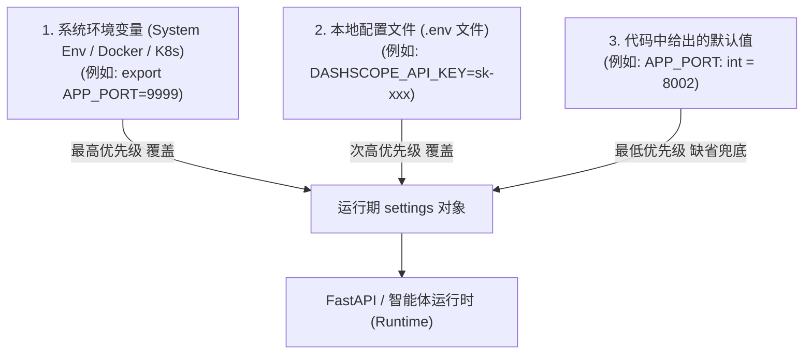

# 执行日志：冗余脚手架文件清理与 Pydantic 动态配置机制说明

**执行时间**: 2026-09-28 14:25:00  
**任务主题**: 删除 `app/agent/llm.py` 与 `app/agent/context.py`，验证 Pydantic Settings 环境变量动态覆盖机制  
**状态**: 成功 (Success)

---

## 1. 任务背景与执行动作
1. **清理冗余脚手架文件 (选项 B)**:
   - 彻底删除 [app/agent/llm.py](file:///d:/code/dianshang/app/agent/llm.py) 与 [app/agent/context.py](file:///d:/code/dianshang/app/agent/context.py)。
   - 当前 `app/agent/` 仅保留核心生产代码：`graph.py`、`recorder.py`、`state.py` 与 `nodes/` 目录。
2. **排查与解答用户对 `Settings(BaseSettings)` 的疑问**:
   - 解释 Pydantic `BaseSettings` 中定义属性值的真实含义：**非“写死”，而是“类型声明与开发缺省兜底值”（Type Hint + Default Fallback）**。
   - 验证环境变量与 `.env` 文件的动态覆写能力（验证命令：设置临时环境变量 `APP_PORT=9999`，读取到的配置即时变为 `9999`，完全覆盖代码里的 `8002`）。

---

## 2. Pydantic Settings 优先级覆盖机制图解 (Mermaid)

---

## 3. 为什么现代工业级框架必须写默认值？
1. **防止少配一个参数全服务崩溃（Zero Crash）**：如果生产或本地忘配某项非关键配置，系统仍能依靠安全默认值优雅启动，而非抛出 `KeyError` 异常退出。
2. **强类型校验（Type Safety）**：如果运维在 `.env` 中把端口误写成了字符串 `APP_PORT=abc`，Pydantic 会在启动时立即拦截报错并指出错误字段，避免运行时出现隐蔽 Bug。
3. **本地开箱即用（Zero-Config Dev Experience）**：新人拉取代码无需手工配置 50 个变量即可直接跑起来，而在测试、预发布、生产环境可通过修改 `.env` 或注入 Docker 环境变量无缝覆盖。
