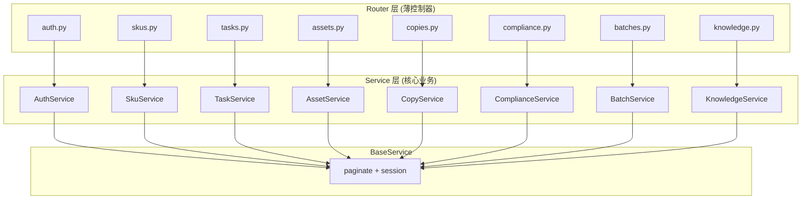

# 执行日志 — 2026-09-29_11-48_Service层架构重构

> 生成时间: 2026-09-29 11:55 CST  
> 触发者: 用户指令 "帮我好好调整下" (Service 层重构)  
> 执行时长: ~7 分钟

---

## 一、用户需求

用户发现 `app/services/` 中的 Service 类全部是空壳（return None / return {} / return True），所有核心业务逻辑写死在 `app/api/v1/*.py` 路由层中，违反了分层架构原则。要求按照标准的三层架构进行重构。

---

## 二、重构前后对比

### 重构前（错误的架构）

```
api/v1/*.py (路由层) ← 全部业务逻辑都在这里（310行巨型文件）
services/*.py        ← 空壳 (return None, return {}, return True)
models/*.py          ← 数据模型定义
```

### 重构后（正确的三层架构）

```
api/v1/*.py (薄路由层) ← 仅: 参数校验 + 权限检查 + 调用 Service + HTTP 响应
services/*.py (核心层) ← 全部: 业务逻辑 + 事务控制 + 数据聚合
models/*.py (数据层)   ← 数据模型定义
```

---

## 三、文件变更清单

### 新建/重写的 Service 文件 (9个)

| 文件 | 职责 | 核心方法 |
|------|------|---------|
| `base.py` | 基类: DB 注入 + 通用分页 | `paginate()` |
| `auth_service.py` | 登录验证 + Token 签发 | `authenticate()`, `refresh_token()` |
| `sku_service.py` | SKU CRUD + 编码唯一性 | `list/create/get/update/delete_sku()` |
| `task_service.py` | 任务生命周期 + 详情聚合 | `list/create/get_detail/get_node_runs/retrigger()` |
| `asset_service.py` | 素材管理 | `list/create/delete_asset()` |
| `copy_service.py` | 文案管理 | `list/get/update_copy()` |
| `compliance_service.py` | 质检报告 + 实时扫描 | `list/get_report()`, `run_realtime_check()` |
| `batch_service.py` | 批次 + 批量任务 | `list/create/get_detail()` |
| `knowledge_service.py` | 知识库 + RAG 向量检索 | `list/create/get_doc()`, `vector_search()` |

### 重写的路由文件 (7个)

| 文件 | 重构前行数 | 重构后行数 | 变化 |
|------|-----------|-----------|------|
| `auth.py` | 89 | 39 | -56% |
| `skus.py` | 189 | 99 | -48% |
| `tasks.py` | 310 | 133 | -57% |
| `assets.py` | 118 | 66 | -44% |
| `copies.py` | 123 | 65 | -47% |
| `compliance.py` | 148 | 60 | -59% |
| `batches.py` | 158 | 83 | -47% |
| `knowledge.py` | 174 | 82 | -53% |

---

## 四、架构设计说明



### 异常处理约定
- **Service 层**: 业务异常统一抛 `ValueError(message)`
- **Router 层**: 捕获 `ValueError` 映射为 `HTTPException(400/404)`
- 数据库异常由 FastAPI 中间件统一兜底

---

## 五、验证结果

### 模块导入测试: 21/21 通过 ✅

### API 端点冒烟测试: 12/12 通过 ✅

```
Health: 200 healthy
Login: 200
SKU List: 200, total=2
Task List: 200, total=1
Asset List: 200, total=4
Copy List: 200, total=1
Compliance Check: 200, score=98.0
Audit Costs: 200
Auth Me: 200
Knowledge Docs: 200
Batches: 200
Providers: 200
```

---

## 六、未变动文件说明

| 文件 | 原因 |
|------|------|
| `audit.py` | 纯查询统计，逻辑简单，无需独立 Service |
| `listings.py` | 逻辑较薄，后续接入真实平台 API 时再抽 Service |
| `packages.py` | 打包导出逻辑，后续接入 MinIO 打包时再抽 Service |
| `providers.py` | 厂商配置管理，与 ProviderFactory 紧耦合，保持现状 |
| `ws.py` | WebSocket 路由，无 Service 需求 |
