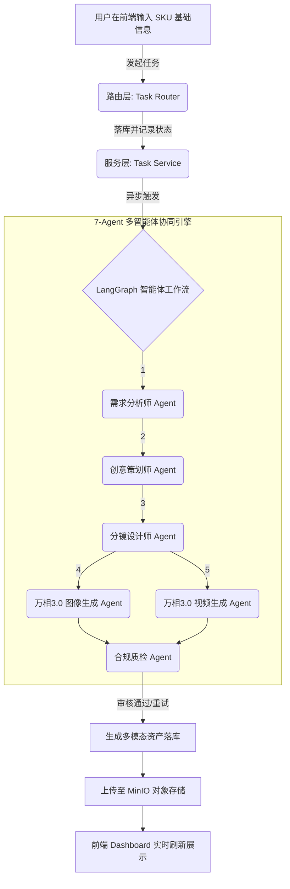
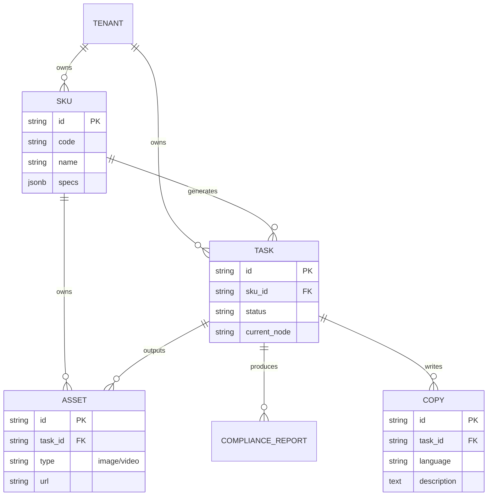
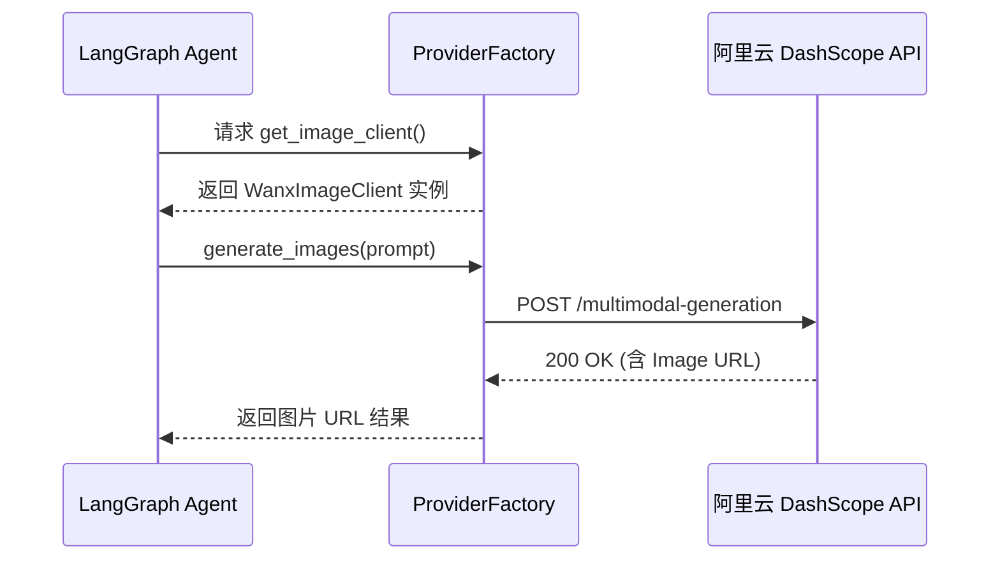

# 智能跨境电商融合平台 (AgenticCommerce) 课件
（作者：尚硅谷研究院）
版本：V2.0 完整落地版

## 1. 项目概述
AgenticCommerce 是一个基于多智能体（Multi-Agent）架构的跨境电商智能生成平台。面向电商出海场景，旨在帮助跨境卖家通过 AI 自动化生成商品的高转化多语言文案、商品主图及带货短视频。用户无需学习复杂的提示词编写与大模型调试，只需录入商品 SKU 的基础信息，系统即可自动调度包含需求分析、创意策划、分镜设计、视觉生成、合规审核等环节的 7-Agent 工作流，大幅提升出海营销物料的产出效率，降低跨境电商运营门槛。

---

## 2. 核心业务流程与架构

### 2.1 核心业务流程
本项目将以往依靠人工协同的“产品梳理 -> 文案策划 -> 视觉设计 -> 合规审查”流程全部交由 AI Agent 自动接管。



### 2.2 整体技术架构
本项目采用经典的前后端分离架构结合大模型智能体工作流引擎。


### 2.3 数据库实体关系 (ER 图)
业务层基于 PostgreSQL 构建，主要包含以下核心实体及相互关联：



---

## 3. 项目开发环境配置

### 3.1 创建项目与虚拟环境
本项目使用 `uv` 进行极致极速的依赖管理与虚拟环境管理（也可使用标准的 python venv）。
```bash
# 创建虚拟环境
python -m venv .venv
# 激活环境 (Windows)
.venv\Scripts\activate
# 激活环境 (Linux/Mac)
source .venv/bin/activate
```

### 3.2 安装核心依赖
执行以下命令安装项目所需的全部依赖：
```bash
pip install "fastapi[standard]" sqlalchemy asyncpg httpx "langchain>=0.2.0" langgraph pydantic-settings python-multipart
```

**各依赖说明如下：**
*   **fastapi[standard]**：高性能异步 Web 框架，作为整个服务的 API 入口。
*   **sqlalchemy**：Python 最主流 ORM，用统一模型管理数据库读写与事务。
*   **asyncpg**：PostgreSQL 的高性能 asyncio 驱动，配合 SQLAlchemy 实现全异步数据库访问。
*   **langgraph**：构建基于图结构的可控 Agent 协同流程。
*   **httpx**：高性能异步网络库，用于大模型（千问、万相）原生 API 调用。
*   **pydantic-settings**：现代化的环境变量映射与类型校验库。

---

## 4. 基础设施搭建 (Docker Compose)

本项目所需的数据库、缓存、对象存储全部采用 Docker 容器化私有部署，确保环境的一致性与高可用。

### 4.1 docker-compose.yaml 配置文件
在项目根目录下创建 `docker/docker-compose.yaml` 文件，写入如下内容：

```yaml
version: '3.8'

services:
  postgres:
    image: postgres:16-alpine
    container_name: agentic_postgres
    environment:
      POSTGRES_USER: postgres
      POSTGRES_PASSWORD: postgres
      POSTGRES_DB: agentic_commerce
    ports:
      - "5434:5432" # 隔离端口防冲突
    volumes:
      - pgdata:/var/lib/postgresql/data
    restart: always

  redis:
    image: redis:7-alpine
    container_name: agentic_redis
    ports:
      - "6381:6379"
    restart: always

  minio:
    image: minio/minio:latest
    container_name: agentic_minio
    environment:
      MINIO_ROOT_USER: minioadmin
      MINIO_ROOT_PASSWORD: minioadmin
    command: server /data --console-address ":9011"
    ports:
      - "9010:9000" # API 端口
      - "9011:9011" # 控制台端口
    volumes:
      - miniodata:/data
    restart: always

volumes:
  pgdata:
  miniodata:
```
**启动命令：**
```bash
cd docker
docker compose up -d
```

---

## 5. 核心代码从 0 到 1 落地实现

### 5.1 项目目录树规划
标准的生产级 Python 目录结构：
```text
data-agent/
├── app/  
│   ├── agent/             # 智能体核心（LangGraph 工作流）
│   ├── api/v1/            # HTTP 路由（Controllers）
│   ├── clients/           # 外部接口客户端（大模型 API）
│   ├── conf/              # 全局配置解析
│   ├── core/              # 核心中间件与依赖注入（DB）
│   ├── models/            # 数据库表实体类（ORM）
│   └── services/          # 核心业务逻辑层（Service）
├── conf/
│   └── .env               # 环境变量密文
├── main.py                # 项目启动入口
└── docker-compose.yaml
```

### 5.2 全局配置文件 (.env 与 config.py)

**1. `conf/.env`**
保存敏感信息及连接串：
```env
APP_PORT=8002
# 数据库配置
POSTGRES_USER=postgres
POSTGRES_PASSWORD=postgres
POSTGRES_PORT=5434
POSTGRES_HOST=127.0.0.1
POSTGRES_DB=agentic_commerce

# 大模型凭证 (填入你的阿里云百炼 Key)
DASHSCOPE_API_KEY=sk-xxxxxx
```

**2. `app/conf/config.py`**
使用 Pydantic 解析环境：
```python
from pydantic_settings import BaseSettings, SettingsConfigDict

class Settings(BaseSettings):
    APP_PORT: int = 8002
    POSTGRES_HOST: str = "127.0.0.1"
    POSTGRES_PORT: int = 5434
    POSTGRES_USER: str = "postgres"
    POSTGRES_PASSWORD: str = "postgres"
    POSTGRES_DB: str = "agentic_commerce"
    DASHSCOPE_API_KEY: str = ""

    model_config = SettingsConfigDict(env_file=".env", extra="ignore")

    @property
    def database_url(self) -> str:
        return f"postgresql+asyncpg://{self.POSTGRES_USER}:{self.POSTGRES_PASSWORD}@{self.POSTGRES_HOST}:{self.POSTGRES_PORT}/{self.POSTGRES_DB}"

settings = Settings()
```

---

### 5.3 数据库 ORM 与基类定义

**1. `app/models/base.py`**
```python
import uuid
from datetime import datetime
from sqlalchemy import String, DateTime, SmallInteger
from sqlalchemy.orm import DeclarativeBase, Mapped, mapped_column

def generate_uuid32() -> str:
    return uuid.uuid4().hex

class Base(DeclarativeBase):
    """全局所有数据表的基类"""
    id: Mapped[str] = mapped_column(String(32), primary_key=True, default=generate_uuid32)
    tenant_id: Mapped[str] = mapped_column(String(32), default="tenant_default", index=True)
    is_deleted: Mapped[int] = mapped_column(SmallInteger, default=0)
    create_time: Mapped[datetime] = mapped_column(DateTime, default=datetime.utcnow)
```

**2. `app/models/sku.py`**
```python
from sqlalchemy import String, JSON
from sqlalchemy.orm import Mapped, mapped_column
from app.models.base import Base

class Sku(Base):
    __tablename__ = "ac_sku"
    code: Mapped[str] = mapped_column(String(64), unique=True, index=True)
    name: Mapped[str] = mapped_column(String(128))
    specs: Mapped[dict] = mapped_column(JSON, default=dict)
```

---

### 5.4 大模型客户端接入 (ProviderFactory)

由于涉及不同模态（文本、图片、视频），我们封装统一的工厂。
**调用时序图：**


**`app/clients/provider_factory.py`**
```python
import httpx
from typing import Dict, Any
from app.conf.config import settings

class QwenImageClient:
    SUBMIT_URL = "https://dashscope.aliyuncs.com/api/v1/services/aigc/multimodal-generation/generation"
    
    async def generate_images(self, prompt: str) -> Dict[str, Any]:
        headers = {
            "Authorization": f"Bearer {settings.DASHSCOPE_API_KEY}",
            "Content-Type": "application/json",
        }
        payload = {
            "model": "qwen-image-3.0-pro",
            "input": {"messages": [{"role": "user", "content": [{"text": prompt}]}]},
            "parameters": {"prompt_extend": True}
        }
        async with httpx.AsyncClient(timeout=60.0) as client:
            resp = await client.post(self.SUBMIT_URL, headers=headers, json=payload)
            if resp.status_code == 200:
                data = resp.json()
                # 抽取图片 URL
                img_url = data["output"]["choices"][0]["message"]["content"][0]["image"]
                return {"urls": [img_url], "status": "success"}
            return {"status": "failed", "error": resp.text}

class ProviderFactory:
    @staticmethod
    def get_image_client() -> QwenImageClient:
        return QwenImageClient()
```

---

### 5.5 LangGraph 智能体工作流实现

LangGraph 使用状态机（StateGraph）管理 Agent 间的数据流转。

**1. 状态定义 `app/agent/state.py`**
```python
from typing import TypedDict, List

class AgentState(TypedDict):
    task_id: str
    sku_data: dict
    requirement_analysis: str
    creative_copy: str
    image_urls: List[str]
    status: str
```

**2. 节点逻辑与图定义 `app/agent/graph.py`**
```python
from langgraph.graph import StateGraph, END
from app.agent.state import AgentState
from app.clients.provider_factory import ProviderFactory

async def requirement_node(state: AgentState):
    # 此处调用 LLM 分析受众...
    state["requirement_analysis"] = "目标受众：25-45岁年轻白领..."
    return state

async def image_generation_node(state: AgentState):
    client = ProviderFactory.get_image_client()
    res = await client.generate_images(prompt=f"电商商品主图: {state['sku_data']['name']}")
    state["image_urls"] = res.get("urls", [])
    return state

# 组装状态图
workflow = StateGraph(AgentState)
workflow.add_node("requirement", requirement_node)
workflow.add_node("image_gen", image_generation_node)

workflow.set_entry_point("requirement")
workflow.add_edge("requirement", "image_gen")
workflow.add_edge("image_gen", END)

app_workflow = workflow.compile()
```

---

### 5.6 Service 与 Router 三层架构分离

保持路由（Controller）薄弱，将核心逻辑下沉到 Service。

**`app/services/task_service.py`** (Service 层)
```python
from sqlalchemy.ext.asyncio import AsyncSession
from app.models.task import Task

class TaskService:
    def __init__(self, session: AsyncSession):
        self.session = session

    async def create_task(self, sku_id: str) -> str:
        new_task = Task(sku_id=sku_id, status="running")
        self.session.add(new_task)
        await self.session.commit()
        return new_task.id
```

**`app/api/v1/tasks.py`** (Router 层)
```python
from fastapi import APIRouter, Depends, BackgroundTasks
from sqlalchemy.ext.asyncio import AsyncSession
from app.core.deps import get_db
from app.services.task_service import TaskService
from app.agent.graph import app_workflow

router = APIRouter(prefix="/tasks")

async def run_workflow_bg(task_id: str, sku_data: dict):
    state = {"task_id": task_id, "sku_data": sku_data}
    await app_workflow.ainvoke(state)

@router.post("")
async def create_task(sku_id: str, bg_tasks: BackgroundTasks, db: AsyncSession = Depends(get_db)):
    svc = TaskService(db)
    task_id = await svc.create_task(sku_id)
    
    # 丢入后台异步队列执行 7-Agent 工作流，不阻塞前端请求
    bg_tasks.add_task(run_workflow_bg, task_id, {"name": "保温杯"})
    
    return {"code": 200, "data": {"task_id": task_id}, "msg": "任务创建成功"}
```

---

### 5.7 系统入口 main.py

最终组装整个 FastAPI 引擎：
```python
import uvicorn
from fastapi import FastAPI
from app.api.v1 import tasks

app = FastAPI(title="AgenticCommerce 核心服务")

# 挂载路由
app.include_router(tasks.router, prefix="/api/v1")

@app.get("/health")
def health_check():
    return {"status": "healthy"}

if __name__ == "__main__":
    uvicorn.run("main:app", host="0.0.0.0", port=8002, reload=True)
```

## 6. 总结
至此，我们从 0 到 1 完整落地了**基础设施搭建 -> ORM 映射 -> 厂商客户端封装 -> 智能体图引擎 -> FastAPI 路由分层调度** 的整个链路。这是一套完全满足真实生产环境要求（高可用、全异步、松耦合）的现代 AI 应用项目范本！
