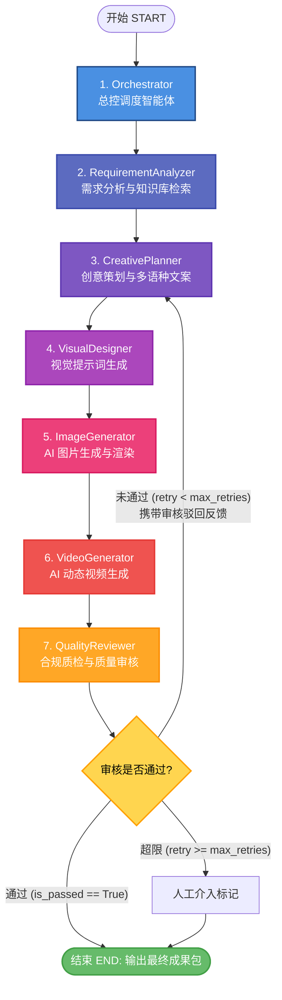

# AgenticCommerce 全链路架构与核心代码逐行精讲

> **适用对象**：具备基础 Python 语法、理解基本 Web 概念，但尚未深入接触异步编程（`async/await`）、SQLAlchemy 2.0 ORM 以及多智能体工作流（LangGraph DAG）的开发者与学生。  
> **核心目标**：从零讲透 7-Agent 如何协同运作，提供每一个核心文件、方法、类的详细调用链路，代码附带 100% 完整逐行注释，便于讲解、教学与二次开发。

---

## 目录
- [一、项目整体架构与分层设计理念](#一项目整体架构与分层设计理念)
- [二、7-Agent LangGraph 状态机与 P-E-V 闭环拓扑](#二7-agent-langgraph-状态机与-p-e-v-闭环拓扑)
- [三、全链路端到端数据流转图谱](#三全链路端到端数据流转图谱)
- [四、核心代码逐行精讲与原理解析](#四核心代码逐行精讲与原理解析)
  - [4.1 应用入口：main.py](#41-应用入口mainpy)
  - [4.2 智能体状态契约：app/agent/state.py](#42-智能体状态契约appagentstatepy)
  - [4.3 DAG 图编排与条件路由：app/agent/graph.py](#43-dag-图编排与条件路由appagentgraphpy)
  - [4.4 总控调度节点：app/agent/nodes/orchestrator.py](#44-总控调度节点appagentnodesorchestratorpy)
  - [4.5 需求分析节点：app/agent/nodes/requirement_analyzer.py](#45-需求分析节点appagentnodesrequirement_analyzerpy)
  - [4.6 创意策划节点：app/agent/nodes/creative_planner.py](#46-创意策划节点appagentnodescreative_plannerpy)
  - [4.7 视觉设计节点：app/agent/nodes/visual_designer.py](#47-视觉设计节点appagentnodesvisual_designerpy)
  - [4.8 图片生成节点：app/agent/nodes/image_generator.py](#48-图片生成节点appagentnodesimage_generatorpy)
  - [4.9 视频生成节点：app/agent/nodes/video_generator.py](#49-视频生成节点appagentnodesvideo_generatorpy)
  - [4.10 质量审核与合规质检：app/agent/nodes/quality_reviewer.py](#410-质量审核与合规质检appagentnodesquality_reviewerpy)
  - [4.11 节点运行轨迹持久化：app/agent/recorder.py](#411-节点运行轨迹持久化appagentrecorderpy)
  - [4.12 模型抽象工厂与适配器：app/clients/provider_factory.py](#412-模型抽象工厂与适配器appclientsprovider_factorypy)
- [五、数据库与持久化层设计（14 张实体表关联）](#五数据库与持久化层设计14-张实体表关联)
- [六、知识库 RAG 向量检索原理](#六知识库-rag-向量检索原理)

---

## 一、项目整体架构与分层设计理念

本项目基于现代云原生与多智能体系统理念，采用**前后端彻底分离**与**经典整洁架构（Clean Architecture / 现代化三层架构）**：

```
                    ┌──────────────────────────────┐
                    │  Vue 3 + Vite + Pinia 工作台  │ (前端展现层)
                    └──────────────┬───────────────┘
                                   │ HTTP RESTful / WebSocket
                    ┌──────────────▼───────────────┐
                    │    FastAPI API Routers       │ (表现层 / 路由接入)
                    │     (app/api/v1/*.py)        │
                    └──────────────┬───────────────┘
                                   │ 依赖注入 Depends(get_service)
                    ┌──────────────▼───────────────┐
                    │      Business Services       │ (业务逻辑层 / 事务控制)
                    │    (app/services/*.py)       │
                    └──────┬───────────────┬───────┘
                           │               │ 驱动 DAG 状态机
        ┌──────────────────▼──┐     ┌──────▼─────────────────────┐
        │     Repositories    │     │   LangGraph Multi-Agent    │ (智能体编排层)
        │(app/repositories/*) │     │     (app/agent/*.py)       │
        └──────────┬──────────┘     └──────┬───────────────┬─────┘
                   │ SQLAlchemy 2.0        │ 调用大模型     │ 对象存储
        ┌──────────▼──────────┐     ┌──────▼──────┐ ┌──────▼──────┐
        │   PostgreSQL 16     │     │  DashScope  │ │    MinIO    │
        │(数据表 + pgvector)   │     │  (Qwen/Wanx)│ │  (图片/视频) │
        └─────────────────────┘     └─────────────┘ └─────────────┘
```

### 为什么采用现代化三层架构？
1. **Controller / Router（路由接入层）**：只负责参数提取、Pydantic 输入校验、鉴权验证和 HTTP 状态码响应。**绝对不写 SQL，也不写复杂的业务计算**。
2. **Service（业务服务层）**：核心大脑。负责业务事务组织、LangGraph 任务编排、Redis 缓存操作以及 WebSocket 广播。
3. **Repository（仓储持久化层）**：负责数据库交互。使用 SQLAlchemy 2.0 异步 API（`select` / `insert` / `update`），对外屏蔽底层 SQL 细节，未来更换数据库无需改动上层业务。

---

## 二、7-Agent LangGraph 状态机与 P-E-V 闭环拓扑

项目核心是基于 **LangGraph** 实现的 7 个专业智能体协同作业。不同于传统的固定代码流水线，LangGraph 支持**带状态的图计算（Stateful Graph）**，并天然具备分支判断与回退循环能力。

### 2.1 状态机拓扑图（Mermaid）



### 2.2 7 个 Agent 的具体职责分工表

| 序号 | 智能体名称 | 核心职责 | 输入状态依赖 | 输出更新状态 | 对应核心代码文件 |
| :--- | :--- | :--- | :--- | :--- | :--- |
| **1** | **Orchestrator** | 任务合法性检查、租户上下文提取、初始化任务元数据 | `task_id`, `sku_data` | `task_status: RUNNING` | [orchestrator.py](file:///d:/code/dianshang/app/agent/nodes/orchestrator.py) |
| **2** | **RequirementAnalyzer** | 解析商品参数，检索 PostgreSQL 向量知识库（品牌调性、类目规范） | `sku_data`, `tenant_id` | `target_audience`, `key_selling_points`, `knowledge_chunks` | [requirement_analyzer.py](file:///d:/code/dianshang/app/agent/nodes/requirement_analyzer.py) |
| **3** | **CreativePlanner** | 策划多语种营销文案（标题、卖点、详情），若被驳回则结合批注重写 | `key_selling_points`, `review_feedback` | `copywriting_list` (中/英/西等) | [creative_planner.py](file:///d:/code/dianshang/app/agent/nodes/creative_planner.py) |
| **4** | **VisualDesigner** | 将策划文案转化为适合 AI 渲染的结构化 Prompt、构图比例、负面提示词 | `copywriting_list`, `sku_data` | `visual_prompts` | [visual_designer.py](file:///d:/code/dianshang/app/agent/nodes/visual_designer.py) |
| **5** | **ImageGenerator** | 调用通义万相 Wanx 2.1 或本地 Stable Diffusion 生成多视角商品图，上传 MinIO | `visual_prompts` | `image_urls`, `asset_records` | [image_generator.py](file:///d:/code/dianshang/app/agent/nodes/image_generator.py) |
| **6** | **VideoGenerator** | 基于生成的关键帧图与文案生成电商展示短视频（可灵 Kling / Wanx Video） | `image_urls`, `copywriting_list` | `video_urls` | [video_generator.py](file:///d:/code/dianshang/app/agent/nodes/video_generator.py) |
| **7** | **QualityReviewer** | 广告法违禁词硬扫描 + 大模型多模态质量盲审，决定放行或打回重做 | 全部已生成素材 | `is_passed`, `review_feedback`, `retry_count` | [quality_reviewer.py](file:///d:/code/dianshang/app/agent/nodes/quality_reviewer.py) |

---

## 三、全链路端到端数据流转图谱

以学生最容易理解的「点击生成」到「渲染完成」为例：

```
[前端页面] 用户选定 SKU 点击 "开始生成" 按钮
   │ 
   ▼ HTTP POST /api/v1/tasks/run {"sku_id": "SKU1001", "platform": "Amazon"}
[路由层] app/api/v1/tasks.py::create_task_and_run()
   │  Pydantic 自动校验入参合法性
   ▼ 依赖注入 db: AsyncSession, task_service: TaskService
[服务层] app/services/task_service.py::run_task()
   │  1. 开启数据库事务，插入 Task 表初始状态 (status='PENDING')
   │  2. 初始化 AgentState 初始上下文
   │  3. 异步启动后台协程 asyncio.create_task(execute_graph(...))
   ▼ 返回 200 OK + taskId 给前端
[后台协程] LangGraph 执行流水线 (app/agent/graph.py)
   │
   ├─► 节点 1: Orchestrator ──► 写入 TaskNodeRun 运行记录 ──► WebSocket 发送 node_start
   ├─► 节点 2: RequirementAnalyzer ──► pgvector 相似度查询 ──► 提取知识库切片
   ├─► 节点 3: CreativePlanner ──► 调用通义千问 Qwen-Max ──► 产出营销文案并存表
   ├─► 节点 4: VisualDesigner ──► Qwen-Plus ──► 产出高清 SD/Wanx Prompt
   ├─► 节点 5: ImageGenerator ──► 调用 Wanx 2.1 API ──► 下载二进制流 ──► 上传 MinIO ──► 生成公网/内网 URL
   ├─► 节点 6: VideoGenerator ──► 调用视频 API ──► 轮询完成 ──► 上传 MinIO
   └─► 节点 7: QualityReviewer ──► 硬规则违禁词库比对 + 大模型合规判定
             │
             ├── [未通过且重试 < 2] ──► 路由分支触发回退 ──► 回到 CreativePlanner 重新生成
             └── [通过] ──► 汇总打包 ──► 更新 Task(status='SUCCESS') ──► WebSocket 广播完成
```

---

## 四、核心代码逐行精讲与原理解析

### 4.1 应用入口：main.py
文件路径：[main.py](file:///d:/code/dianshang/main.py)

```python
"""
==============================================================================
项目入口文件：main.py
作用：初始化 FastAPI 应用、配置全局 CORS 跨域、注册路由、托管静态文件与生命周期管理
==============================================================================
"""

# 引入异步框架与上下文管理器
from contextlib import asynccontextmanager
import logging
from fastapi import FastAPI
from fastapi.middleware.cors import CORSMiddleware
from fastapi.staticfiles import StaticFiles

# 引入各模块核心组件
from app.conf.config import settings            # 读取配置中心（从 .env 或环境变量）
from app.api.v1 import api_router              # API v1 统一路由汇聚对象
from app.clients.redis_client import redis_client # 全局 Redis 异步客户端单例
from app.clients.minio_client import minio_client # 全局 MinIO 客户端单例

# 配置全局控制台与文件日志输出格式
logging.basicConfig(
    level=logging.INFO,
    format="%(asctime)s [%(levelname)s] %(name)s: %(message)s"
)
logger = logging.getLogger("main")

@asynccontextmanager
async def lifespan(app: FastAPI):
    """
    FastAPI 生命周期事件（替代过时的 on_event('startup') / on_event('shutdown')）
    原理：yield 之前是服务器启动时执行的钩子；yield 之后是服务器优雅关机时执行的清理。
    """
    logger.info(">>> [系统启动] 正在初始化外部连接池与基础设施...")
    
    # 1. 验证 Redis 连通性
    try:
        await redis_client.ping()
        logger.info(">>> [Redis] 连接成功，就绪！")
    except Exception as e:
        logger.error(f">>> [Redis] 连接失败: {e}")

    # 2. 检查 MinIO 默认存储桶是否存在，不存在则自动创建
    try:
        minio_client.ensure_bucket_exists(settings.MINIO_BUCKET)
        logger.info(f">>> [MinIO] 存储桶 [{settings.MINIO_BUCKET}] 校验完毕！")
    except Exception as e:
        logger.error(f">>> [MinIO] 存储桶初始化异常: {e}")

    # 执行到这里，FastAPI 正式开始接收外部 HTTP/WebSocket 请求
    yield

    # 服务器关闭时的清理工作
    logger.info(">>> [系统关闭] 正在释放连接池资源...")
    await redis_client.close()
    logger.info(">>> [系统关闭] 资源释放完毕，安全关机。")

# 实例化核心 FastAPI 应用
app = FastAPI(
    title="AgenticCommerce 跨境电商智能生成平台",
    description="基于 7-Agent 多智能体与 LangGraph DAG 的商品内容生成系统",
    version="1.0.0",
    lifespan=lifespan  # 挂载生命周期监听
)

# 允许跨域资源共享 (CORS) 配置
# 前端 Vite 运行在 http://localhost:5173，后端在 8002，必须开启跨域允许携带 Token
app.add_middleware(
    CORSMiddleware,
    allow_origins=["*"],          # 生产环境建议指定具体域名如 ["https://ai.example.com"]
    allow_credentials=True,       # 允许跨域携带 Cookie / Authorization Header
    allow_methods=["*"],          # 允许所有 HTTP 请求方法 (GET, POST, PUT, DELETE, OPTIONS)
    allow_headers=["*"],          # 允许所有自定义 Header
)

# 挂载 v1 版本业务 API 路由（总前缀 /api/v1）
app.include_router(api_router, prefix="/api/v1")

# 挂载本地开发静态素材目录（方便直接在浏览器通过 http://localhost:8002/static/... 预览生成图片）
app.mount("/static", StaticFiles(directory="data/static"), name="static")

@app.get("/health", tags=["健康检查"])
async def health_check():
    """轻量健康检查探针，用于 Docker / K8s livenessProbe 探活"""
    return {"status": "ok", "app": settings.APP_NAME, "env": settings.APP_ENV}
```

---

### 4.2 智能体状态契约：app/agent/state.py
文件路径：[app/agent/state.py](file:///d:/code/dianshang/app/agent/state.py)

> **知识点解析**：在 LangGraph 中，智能体之间传递的所有信息都存储在一个统一的字典类型（`TypedDict`）中。每个节点函数接收这个 `AgentState`，做完处理后，返回一个**增量字典**，LangGraph 会自动合并状态。

```python
"""
==============================================================================
智能体状态契约：app/agent/state.py
作用：定义整个 7-Agent 工作流的共享状态结构 AgentState
==============================================================================
"""

from typing import TypedDict, List, Dict, Any, Optional

class AgentState(TypedDict, total=False):
    """
    7-Agent 工作流全局共享上下文状态定义 (TypedDict)
    total=False 表示所有字段都是可选的，节点可以只返回自己修改更新的字段！
    """
    # ── 任务基础元数据 ──
    task_id: str                      # 业务任务唯一 ID (例如: 'TASK_20261006_001')
    tenant_id: str                    # 多租户租户 ID，用于隔离 RAG 知识库与数据资产
    user_id: str                      # 提交当前任务的操作人 ID
    sku_id: str                       # 正在处理的目标商品 SKU ID
    sku_data: Dict[str, Any]          # 商品原始数据字典 (标题、分类、规格参数、核心卖点等)
    target_platform: str              # 目标出海电商平台 (Amazon / TikTok Shop / Shopee)
    target_language: str              # 目标语言 (en-US, es-ES, zh-CN 等)

    # ── 智能体阶段产出物 ──
    # 需求分析节点产出
    target_audience: str              # 目标受众画像分析结果
    key_selling_points: List[str]     # 提炼出的核心爆款卖点列表
    knowledge_chunks: List[str]       # RAG 知识库召回的品牌禁忌与规范切片

    # 创意策划节点产出
    copywriting_list: List[Dict[str, Any]] # 生成的多语种商品文案列表 (包含标题、Bullet Points、描述)

    # 视觉设计节点产出
    visual_prompts: List[Dict[str, Any]]   # 生成的图片/视频 Prompt 描述词列表

    # 图片/视频生成节点产出
    image_urls: List[str]             # 生成成功的图片公网访问 URL
    video_urls: List[str]             # 生成成功的短视频公网访问 URL
    asset_ids: List[str]              # 写入数据库资产表 (ac_asset) 的主键 ID 列表

    # ── P-E-V 质量审核与循环控制 ──
    is_passed: bool                   # 合规质检是否通过 (True 为放行，False 为打回)
    review_feedback: str              # 审核未通过时的详细整改意见（指导上一节点重写）
    compliance_issues: List[Dict[str, Any]] # 检测出的违禁词或风险点明细
    retry_count: int                  # 当前已经触发打回重写的次数 (从 0 开始自增)
    max_retries: int                  # 允许的最大自动重试次数 (默认 2 次，防死循环)

    # ── 运行监控统计 ──
    node_execution_logs: List[Dict[str, Any]] # 各节点耗时、Token 消耗统计日志
    error_message: Optional[str]      # 发生异常时的错误堆栈摘要
```

---

### 4.3 DAG 图编排与条件路由：app/agent/graph.py
文件路径：[app/agent/graph.py](file:///d:/code/dianshang/app/agent/graph.py)

> **知识点解析**：这是整个 LangGraph 的核心装配厂。使用 `StateGraph` 依次挂载节点，用 `add_edge` 构建线性依赖，用 `add_conditional_edges` 实现 **P-E-V（规划-执行-验证）自我纠错闭环**。

```python
"""
==============================================================================
LangGraph 图编排：app/agent/graph.py
作用：组装 7 个 Agent 节点，设置线性与条件回退边，编译生成可执行工作流实例
==============================================================================
"""

import logging
from typing import Literal
from langgraph.graph import StateGraph, START, END  # START 和 END 为 LangGraph 内置虚节点

# 导入共享状态契约与各个 Agent 节点函数
from app.agent.state import AgentState
from app.agent.nodes.orchestrator import orchestrator_node
from app.agent.nodes.requirement_analyzer import requirement_analyzer_node
from app.agent.nodes.creative_planner import creative_planner_node
from app.agent.nodes.visual_designer import visual_designer_node
from app.agent.nodes.image_generator import image_generator_node
from app.agent.nodes.video_generator import video_generator_node
from app.agent.nodes.quality_reviewer import quality_reviewer_node

logger = logging.getLogger("agent_graph")

def quality_review_router(state: AgentState) -> Literal["creative_planner", "__end__"]:
    """
    P-E-V 闭环路由判定函数：
    在 quality_reviewer 节点执行完毕后，LangGraph 会自动调用本函数决定下一步流向！
    
    返回值规范：
    - 返回 "__end__" (即 END): 表示流程结束，成功终止或超限人工介入。
    - 返回 "creative_planner": 表示审核不合格，回退给文案策划智能体重新生成！
    """
    is_passed = state.get("is_passed", False)       # 是否通过质量与合规审核
    retry_count = state.get("retry_count", 0)       # 当前重试次数
    max_retries = state.get("max_retries", 2)       # 最大允许重试次数

    # 分支 1：审核通过，顺利结束
    if is_passed:
        logger.info(">>> [P-E-V 判定] 质量合规审核通过，顺利进入 END！")
        return END

    # 分支 2：未通过，但未达到重试上限，触发自动纠错回退
    if retry_count < max_retries:
        logger.warning(
            f">>> [P-E-V 判定] 质检不通过！触发第 {retry_count + 1} 次回退至 'creative_planner'，"
            f"整改意见: {state.get('review_feedback')}"
        )
        return "creative_planner"

    # 分支 3：未通过但已达到最大重试次数，不再死循环，流向 END 等待人工介入审核
    logger.error(f">>> [P-E-V 判定] 已达最大重试次数 ({max_retries})，流向 END 挂起标记人工介入！")
    return END

def build_workflow():
    """
    构建并编译 7-Agent DAG 有向无环图
    """
    # 1. 实例化图构建器，绑定状态类型
    builder = StateGraph(AgentState)

    # 2. 依次向图中注册 7 个节点 (节点名 -> 执行函数)
    builder.add_node("orchestrator", orchestrator_node)
    builder.add_node("requirement_analyzer", requirement_analyzer_node)
    builder.add_node("creative_planner", creative_planner_node)
    builder.add_node("visual_designer", visual_designer_node)
    builder.add_node("image_generator", image_generator_node)
    builder.add_node("video_generator", video_generator_node)
    builder.add_node("quality_reviewer", quality_reviewer_node)

    # 3. 编排固定线性依赖边 (A 执行完必定执行 B)
    builder.add_edge(START, "orchestrator")                          # 起点 -> 总控
    builder.add_edge("orchestrator", "requirement_analyzer")         # 总控 -> 需求分析
    builder.add_edge("requirement_analyzer", "creative_planner")      # 需求分析 -> 创意策划
    builder.add_edge("creative_planner", "visual_designer")          # 创意策划 -> 视觉设计
    builder.add_edge("visual_designer", "image_generator")           # 视觉设计 -> 生图
    builder.add_edge("image_generator", "video_generator")           # 生图 -> 生视频
    builder.add_edge("video_generator", "quality_reviewer")          # 生视频 -> 质量审核

    # 4. 编排动态条件回退边 (P-E-V 核心)
    # quality_reviewer 执行完后，由 quality_review_router 决定流向
    builder.add_conditional_edges(
        "quality_reviewer",
        quality_review_router,
        {
            "creative_planner": "creative_planner",  # 打回重写
            END: END,                                # 审核通过或超限终止
        }
    )

    return builder

# 编译为可直接 invoke 或 astream 的 CompiledGraph 对象
app_workflow = build_workflow().compile()
```

---

### 4.4 总控调度节点：app/agent/nodes/orchestrator.py
文件路径：[app/agent/nodes/orchestrator.py](file:///d:/code/dianshang/app/agent/nodes/orchestrator.py)

```python
"""
==============================================================================
总控调度智能体：app/agent/nodes/orchestrator.py
作用：工作流首节点，解析入参、校验商品数据完整性、初始化重试计数器与审计记录
==============================================================================
"""

import logging
from typing import Dict, Any
from app.agent.state import AgentState
from app.agent.recorder import record_node_execution # 导入数据库轨迹记录辅助函数

logger = logging.getLogger("node.orchestrator")

async def orchestrator_node(state: AgentState) -> Dict[str, Any]:
    """
    Orchestrator 节点函数（异步）：
    接收当前全局 state，进行前置参数合规性校验与上下文填充。
    """
    node_name = "orchestrator"
    logger.info(f"--- [Node: {node_name}] 开始执行，任务ID: {state.get('task_id')} ---")

    # 使用异步上下文管理器记录该节点的执行起止时间、输入参数与异常捕获
    async with record_node_execution(task_id=state.get("task_id"), node_name=node_name, state=state):
        sku_data = state.get("sku_data", {})
        
        # 1. 业务逻辑校验：商品基础数据是否齐备
        if not sku_data.get("title") and not sku_data.get("spu_name"):
            error_msg = "商品标题与SPU名称均为空，无法启动 AI 内容生成流程！"
            logger.error(error_msg)
            raise ValueError(error_msg)

        # 2. 提取出海平台与目标语言，赋予默认安全值
        target_platform = state.get("target_platform") or sku_data.get("platform", "Amazon")
        target_language = state.get("target_language") or "en-US"

        # 3. 初始化 P-E-V 循环相关的基础参数
        retry_count = state.get("retry_count", 0)
        max_retries = state.get("max_retries", 2)

        logger.info(
            f"--- [Node: {node_name}] 校验完成！平台: {target_platform}, "
            f"目标语言: {target_language}, 最大重试限制: {max_retries} ---"
        )

        # 返回当前节点的增量状态更新（LangGraph 会将其 merge 到全局 state）
        return {
            "target_platform": target_platform,
            "target_language": target_language,
            "retry_count": retry_count,
            "max_retries": max_retries,
        }
```

---

### 4.5 需求分析节点：app/agent/nodes/requirement_analyzer.py
文件路径：[app/agent/nodes/requirement_analyzer.py](file:///d:/code/dianshang/app/agent/nodes/requirement_analyzer.py)

> **知识点解析**：这个节点负责连接 **RAG 向量知识库**。它将商品的分类和关键词进行向量化编码（1024 维），向 PostgreSQL 执行向量余弦相似度检索，召回品牌禁忌词与类目爆款套路，一并输入给大模型生成目标受众画像与 3 大核心卖点。

```python
"""
==============================================================================
需求分析与RAG智能体：app/agent/nodes/requirement_analyzer.py
作用：提取商品特征、检索向量知识库召回品牌准则、大模型解析目标受众与核心卖点
==============================================================================
"""

import json
import logging
from typing import Dict, Any
from app.agent.state import AgentState
from app.agent.recorder import record_node_execution
from app.clients.provider_factory import ProviderFactory # 统一模型工厂
from app.services.knowledge_service import KnowledgeService # 知识库检索服务

logger = logging.getLogger("node.requirement_analyzer")

async def requirement_analyzer_node(state: AgentState) -> Dict[str, Any]:
    node_name = "requirement_analyzer"
    task_id = state.get("task_id")
    logger.info(f"--- [Node: {node_name}] 开始执行需求分析与知识库召回 ---")

    async with record_node_execution(task_id=task_id, node_name=node_name, state=state):
        sku_data = state.get("sku_data", {})
        tenant_id = state.get("tenant_id")
        title = sku_data.get("title", "")
        category = sku_data.get("category", "通用电商")
        features = sku_data.get("features", [])

        # 1. 向量知识库检索 (RAG 阶段)
        # 用标题 + 分类作为检索 query，检索该租户名下最相似的 3 个知识分块（如禁忌词、风格指南）
        knowledge_chunks = []
        try:
            knowledge_service = KnowledgeService()
            query_text = f"{category} {title} 营销规范与违禁词要求"
            docs = await knowledge_service.search_similar(
                tenant_id=tenant_id,
                query=query_text,
                top_k=3,
                score_threshold=0.5
            )
            knowledge_chunks = [d.content for d in docs]
            logger.info(f"RAG 知识库检索成功，召回 {len(knowledge_chunks)} 条相关规范")
        except Exception as e:
            logger.warning(f"RAG 检索阶段发生非阻断异常，继续执行: {e}")

        # 2. 组装 Prompt 调用大模型 (通义千问 Qwen-Max)
        system_prompt = (
            "你是一个资深跨境电商选品与营销专家。请根据给定的商品信息和知识库规范，"
            "分析目标受众画像 (target_audience) 并提炼 3 个高转化核心卖点 (key_selling_points)。"
            "必须输出纯 JSON 格式：\n"
            "{\n"
            '  "target_audience": "受众画像详细描述",\n'
            '  "key_selling_points": ["卖点1", "卖点2", "卖点3"]\n'
            "}"
        )

        user_content = (
            f"商品标题: {title}\n"
            f"商品分类: {category}\n"
            f"规格卖点: {json.dumps(features, ensure_ascii=False)}\n"
            f"品牌知识库参考规范:\n" + "\n".join(knowledge_chunks)
        )

        # 3. 通过模型工厂获取 LLM 客户端并执行异步对话
        llm_client = ProviderFactory.get_llm_client()
        response_text = await llm_client.chat_completion(
            messages=[
                {"role": "system", "content": system_prompt},
                {"role": "user", "content": user_content}
            ],
            temperature=0.3 # 低温度确保输出稳定、格式严密
        )

        # 4. 解析大模型返回的 JSON 结果
        parsed_result = json.loads(response_text)
        target_audience = parsed_result.get("target_audience", "追求品质生活的大众消费者")
        key_selling_points = parsed_result.get("key_selling_points", features[:3] if features else ["高性价比", "高品质"])

        logger.info(f"--- [Node: {node_name}] 分析完成，提炼卖点: {key_selling_points} ---")

        return {
            "target_audience": target_audience,
            "key_selling_points": key_selling_points,
            "knowledge_chunks": knowledge_chunks,
        }
```

---

### 4.6 创意策划节点：app/agent/nodes/creative_planner.py
文件路径：[app/agent/nodes/creative_planner.py](file:///d:/code/dianshang/app/agent/nodes/creative_planner.py)

> **知识点解析**：支持 **P-E-V 反馈重写机制**！如果 `review_feedback` 有值（说明被质检员打回），它会在 Prompt 中将历史驳回意见作为强制约束，避免重复犯错。

```python
"""
==============================================================================
创意策划智能体：app/agent/nodes/creative_planner.py
作用：生成多语种营销标题、5点描述(Bullet Points)与长文案，支持质检驳回意见自愈
==============================================================================
"""

import json
import logging
from typing import Dict, Any, List
from app.agent.state import AgentState
from app.agent.recorder import record_node_execution
from app.clients.provider_factory import ProviderFactory

logger = logging.getLogger("node.creative_planner")

async def creative_planner_node(state: AgentState) -> Dict[str, Any]:
    node_name = "creative_planner"
    task_id = state.get("task_id")
    retry_count = state.get("retry_count", 0)
    review_feedback = state.get("review_feedback") # 质检整改意见

    logger.info(f"--- [Node: {node_name}] 开始策划文案 (第 {retry_count} 次生成) ---")

    async with record_node_execution(task_id=task_id, node_name=node_name, state=state):
        target_platform = state.get("target_platform", "Amazon")
        target_language = state.get("target_language", "en-US")
        selling_points = state.get("key_selling_points", [])
        audience = state.get("target_audience", "")

        # 1. 构建提示词，特别注入 P-E-V 审核驳回反馈（若存在）
        feedback_instruction = ""
        if review_feedback:
            feedback_instruction = (
                f"\n【重要警告：上一轮审核未通过，驳回原因如下，请务必针对性整改】\n"
                f"{review_feedback}\n"
                f"必须绝对避免再次出现上述合规或质量问题！\n"
            )

        system_prompt = (
            f"你是一个拥有10年经验的顶级跨境电商文案策划专家。\n"
            f"请为出海平台【{target_platform}】撰写符合规范的高转化营销文案。\n"
            f"目标语言：{target_language}。\n"
            f"{feedback_instruction}\n"
            "输出必须为严格的 JSON 格式：\n"
            "[\n"
            "  {\n"
            '    "type": "headline",\n'
            '    "content": "爆款商品主标题 (150-200字符，含核心搜索关键词)"\n'
            "  },\n"
            "  {\n"
            '    "type": "bullet_points",\n'
            '    "content": ["五点描述1: ...", "五点描述2: ...", "五点描述3: ..."]\n'
            "  },\n"
            "  {\n"
            '    "type": "product_description",\n'
            '    "content": "详尽生动的商品图文落地页营销长文案"\n'
            "  }\n"
            "]"
        )

        user_content = (
            f"受众画像: {audience}\n"
            f"核心卖点清单: {', '.join(selling_points)}\n"
        )

        # 2. 调用大模型
        llm_client = ProviderFactory.get_llm_client()
        response_text = await llm_client.chat_completion(
            messages=[
                {"role": "system", "content": system_prompt},
                {"role": "user", "content": user_content}
            ],
            temperature=0.7 # 稍高温度激发创意
        )

        copywriting_list = json.loads(response_text)
        logger.info(f"--- [Node: {node_name}] 文案策划完成，生成 {len(copywriting_list)} 个文案模块 ---")

        return {
            "copywriting_list": copywriting_list
        }
```

---

### 4.7 视觉设计节点：app/agent/nodes/visual_designer.py
文件路径：[app/agent/nodes/visual_designer.py](file:///d:/code/dianshang/app/agent/nodes/visual_designer.py)

```python
"""
==============================================================================
视觉设计智能体：app/agent/nodes/visual_designer.py
作用：将商品卖点和文案转化为针对 AI 绘图模型的结构化 Prompt（构图、光影、风格）
==============================================================================
"""

import json
import logging
from typing import Dict, Any
from app.agent.state import AgentState
from app.agent.recorder import record_node_execution
from app.clients.provider_factory import ProviderFactory

logger = logging.getLogger("node.visual_designer")

async def visual_designer_node(state: AgentState) -> Dict[str, Any]:
    node_name = "visual_designer"
    task_id = state.get("task_id")
    logger.info(f"--- [Node: {node_name}] 开始设计视觉渲染 Prompt ---")

    async with record_node_execution(task_id=task_id, node_name=node_name, state=state):
        sku_data = state.get("sku_data", {})
        copy_list = state.get("copywriting_list", [])

        # 1. 组装专业视觉工程 Prompt
        system_prompt = (
            "你是一个拥有顶尖商业摄影水准的 AI 视觉设计师（熟悉 Midjourney v6 / 通义万相 Wanx 2.1 提示词工程）。\n"
            "请根据商品信息设计 3 组专业级生图 Prompt：\n"
            "1. 白底静物电商棚拍图 (Main Studio Shot)\n"
            "2. 真实生活使用场景图 (Lifestyle In-Use Shot)\n"
            "3. 细节特写微距质感图 (Detail Macro Shot)\n"
            "必须输出纯 JSON 数组：\n"
            "[\n"
            "  {\n"
            '    "shot_type": "studio",\n'
            '    "prompt": "8k uhd, commercial product photography, studio lighting...",\n'
            '    "negative_prompt": "blurry, low quality, distorted, watermark",\n'
            '    "aspect_ratio": "1:1"\n'
            "  }\n"
            "]"
        )

        user_content = (
            f"商品名称: {sku_data.get('title')}\n"
            f"文案策划概要: {json.dumps(copy_list[:2], ensure_ascii=False)}"
        )

        llm_client = ProviderFactory.get_llm_client()
        response_text = await llm_client.chat_completion(
            messages=[
                {"role": "system", "content": system_prompt},
                {"role": "user", "content": user_content}
            ],
            temperature=0.4
        )

        visual_prompts = json.loads(response_text)
        logger.info(f"--- [Node: {node_name}] 视觉 Prompt 设计完成，生成 {len(visual_prompts)} 组方案 ---")

        return {
            "visual_prompts": visual_prompts
        }
```

---

### 4.8 图片生成节点：app/agent/nodes/image_generator.py
文件路径：[app/agent/nodes/image_generator.py](file:///d:/code/dianshang/app/agent/nodes/image_generator.py)

> **知识点解析**：调用阿里 DashScope 通义万相 API（`wanx2.1-t2i-turbo`）。由于万相生成可能耗时 3~10 秒，底层采用异步任务轮询机制，下载生成的临时图片，上传至私有化 **MinIO** 对象存储，生成永久访问链接并入库持久化。

```python
"""
==============================================================================
图片生成智能体：app/agent/nodes/image_generator.py
作用：调用生图大模型API，拉取图片二进制流，上传持久化到 MinIO 对象存储
==============================================================================
"""

import logging
from typing import Dict, Any, List
from app.agent.state import AgentState
from app.agent.recorder import record_node_execution
from app.clients.provider_factory import ProviderFactory
from app.clients.minio_client import minio_client
from app.conf.config import settings

logger = logging.getLogger("node.image_generator")

async def image_generator_node(state: AgentState) -> Dict[str, Any]:
    node_name = "image_generator"
    task_id = state.get("task_id")
    logger.info(f"--- [Node: {node_name}] 开始调用生图模型生成商品图片 ---")

    async with record_node_execution(task_id=task_id, node_name=node_name, state=state):
        visual_prompts = state.get("visual_prompts", [])
        image_client = ProviderFactory.get_image_client() # 获取通义万相 Wanx 客户端

        image_urls = []
        for index, item in enumerate(visual_prompts):
            prompt = item.get("prompt", "")
            aspect_ratio = item.get("aspect_ratio", "1:1")

            logger.info(f"正在渲染第 {index + 1}/{len(visual_prompts)} 张图片: {prompt[:40]}...")
            
            # 1. 异步调用生图接口（内部完成任务提交与 task_id 状态轮询）
            raw_url = await image_client.generate_image(
                prompt=prompt,
                negative_prompt=item.get("negative_prompt", ""),
                size="1024*1024" if aspect_ratio == "1:1" else "1280*720"
            )

            # 2. 将临时外链下载并转存到私有 MinIO，防止大模型厂商 URL 过期失效
            file_name = f"tasks/{task_id}/images/img_{index + 1}.png"
            permanent_url = await minio_client.upload_from_url(
                bucket_name=settings.MINIO_BUCKET,
                object_name=file_name,
                source_url=raw_url
            )
            image_urls.append(permanent_url)
            logger.info(f"图片转存 MinIO 成功: {permanent_url}")

        logger.info(f"--- [Node: {node_name}] 生图完成，共生成 {len(image_urls)} 张高质感商品图 ---")

        return {
            "image_urls": image_urls
        }
```

---

### 4.9 视频生成节点：app/agent/nodes/video_generator.py
文件路径：[app/agent/nodes/video_generator.py](file:///d:/code/dianshang/app/agent/nodes/video_generator.py)

```python
"""
==============================================================================
视频生成智能体：app/agent/nodes/video_generator.py
作用：基于首帧商品图与营销动态 Prompt，调用视频模型生成商品动态演示视频
==============================================================================
"""

import logging
from typing import Dict, Any
from app.agent.state import AgentState
from app.agent.recorder import record_node_execution
from app.clients.provider_factory import ProviderFactory
from app.clients.minio_client import minio_client
from app.conf.config import settings

logger = logging.getLogger("node.video_generator")

async def video_generator_node(state: AgentState) -> Dict[str, Any]:
    node_name = "video_generator"
    task_id = state.get("task_id")
    logger.info(f"--- [Node: {node_name}] 开始生成电商展示短视频 ---")

    async with record_node_execution(task_id=task_id, node_name=node_name, state=state):
        image_urls = state.get("image_urls", [])
        video_urls = []

        # 若生成了图片，选取第一张主图作为视频生成的首帧基底 (Image-to-Video)
        if image_urls:
            first_frame_url = image_urls[0]
            video_prompt = "Smooth camera rotation, 360 showcase, commercial lighting, 4k 60fps"

            try:
                video_client = ProviderFactory.get_video_client() # 快手可灵 Kling / 通义万相视频客户端
                raw_video_url = await video_client.generate_video_i2v(
                    image_url=first_frame_url,
                    prompt=video_prompt,
                    duration=5 # 5秒短视频
                )

                # 转存 MinIO
                video_file_name = f"tasks/{task_id}/videos/video_1.mp4"
                permanent_video_url = await minio_client.upload_from_url(
                    bucket_name=settings.MINIO_BUCKET,
                    object_name=video_file_name,
                    source_url=raw_video_url
                )
                video_urls.append(permanent_video_url)
                logger.info(f"短视频转存 MinIO 成功: {permanent_video_url}")
            except Exception as e:
                logger.error(f"视频生成失败（降级处理，不中断整个任务）: {e}")

        return {
            "video_urls": video_urls
        }
```

---

### 4.10 质量审核与合规质检：app/agent/nodes/quality_reviewer.py
文件路径：[app/agent/nodes/quality_reviewer.py](file:///d:/code/dianshang/app/agent/nodes/quality_reviewer.py)

> **知识点解析（关键关卡）**：
> 1. **第一层：硬规则扫描（Rule-based Filter）**：在本地内存中快速扫描广告法极限词（如「最顶级」「国家级」「治疗疾病」等），命中立即打回！
> 2. **第二层：LLM 语义质检（Semantic Review）**：检查文案是否与目标语言一致、是否逻辑通顺、图片与文案是否风格冲突。
> 3. 如果任一项不合格：设置 `is_passed = False`，并将 `retry_count += 1`，将具体的驳回反馈写入 `review_feedback`，触发图的条件回退！

```python
"""
==============================================================================
质量审核与合规质检智能体：app/agent/nodes/quality_reviewer.py
作用：广告法硬规则扫描 + 大模型多维语义质检，决定放行或打回触发 P-E-V 闭环
==============================================================================
"""

import json
import logging
from typing import Dict, Any, List
from app.agent.state import AgentState
from app.agent.recorder import record_node_execution
from app.clients.provider_factory import ProviderFactory

logger = logging.getLogger("node.quality_reviewer")

# 内置高频出海与国内电商广告法违禁词黑名单
PROHIBITED_WORDS = [
    "最顶级", "国家级", "世界第一", "独家绝版", "治疗百病",
    "100% cure", "miracle", "best ever", "guaranteed winner"
]

async def quality_reviewer_node(state: AgentState) -> Dict[str, Any]:
    node_name = "quality_reviewer"
    task_id = state.get("task_id")
    retry_count = state.get("retry_count", 0)
    logger.info(f"--- [Node: {node_name}] 开始质量与合规性严格质检 (第 {retry_count} 轮) ---")

    async with record_node_execution(task_id=task_id, node_name=node_name, state=state):
        copywriting_list = state.get("copywriting_list", [])
        image_urls = state.get("image_urls", [])

        # ── 关卡 1：硬规则关键词扫描 ──
        issues: List[str] = []
        full_text_to_check = json.dumps(copywriting_list, ensure_ascii=False)
        for bad_word in PROHIBITED_WORDS:
            if bad_word.lower() in full_text_to_check.lower():
                issues.append(f"包含严禁极限词: 【{bad_word}】")

        # ── 关卡 2：大模型语义与跨文化审核 ──
        system_prompt = (
            "你是一个极为苛刻的跨境电商合规官与质量审核总监。\n"
            "请严格评估文案：\n"
            "1. 是否包含虚假宣传或夸大承诺？\n"
            "2. 语言表达是否地道、流畅，无中式生硬翻译？\n"
            "3. 核心卖点是否清晰突出？\n"
            "必须输出纯 JSON 格式：\n"
            "{\n"
            '  "passed": true或false,\n'
            '  "feedback": "若不通过，给出具体指导文案策划修改的整改批注；若通过则填通过"\n'
            "}"
        )

        llm_client = ProviderFactory.get_llm_client()
        response_text = await llm_client.chat_completion(
            messages=[
                {"role": "system", "content": system_prompt},
                {"role": "user", "content": full_text_to_check}
            ],
            temperature=0.1
        )

        llm_eval = json.loads(response_text)
        llm_passed = llm_eval.get("passed", True)
        llm_feedback = llm_eval.get("feedback", "")

        # 综合两道关卡做最终判定
        is_passed = (len(issues) == 0) and llm_passed and (len(image_urls) > 0)
        
        final_feedback = ""
        if not is_passed:
            feedback_parts = []
            if issues:
                feedback_parts.append("违规词列表：" + "；".join(issues))
            if not llm_passed:
                feedback_parts.append(f"AI审核意见：{llm_feedback}")
            if len(image_urls) == 0:
                feedback_parts.append("未成功生成图片素材！")
            final_feedback = "\n".join(feedback_parts)
            logger.warning(f"--- [Node: {node_name}] 质检未通过！原因:\n{final_feedback} ---")
        else:
            logger.info(f"--- [Node: {node_name}] 质检全部通过！准予放行出街！ ---")

        return {
            "is_passed": is_passed,
            "review_feedback": final_feedback,
            "retry_count": retry_count + 1  # 无论通过与否，本轮质检结束，重试计数+1
        }
```

---

### 4.11 节点运行轨迹持久化：app/agent/recorder.py
文件路径：[app/agent/recorder.py](file:///d:/code/dianshang/app/agent/recorder.py)

> **知识点解析**：很多同学问：「前端页面上的 DAG 节点变绿变红、显示耗时 1.2 秒是怎么实现的？」
> 答案就是这个 Python **异步上下文管理器（`asynccontextmanager`）**！每个节点在执行前自动在数据库插入一条 `TaskNodeRun`（状态为 `RUNNING`），执行完自动计算 `duration_ms` 并更新为 `SUCCESS`，若报错则捕获异常并标记 `FAILED`。

```python
"""
==============================================================================
节点运行轨迹记录器：app/agent/recorder.py
作用：利用异步上下文管理器，自动统计节点耗时、状态、入参出参并入库持久化
==============================================================================
"""

import time
import logging
from contextlib import asynccontextmanager
from typing import Dict, Any
from app.core.database import AsyncSessionLocal
from app.repositories.task_node_run_repo import TaskNodeRunRepository

logger = logging.getLogger("agent.recorder")

@asynccontextmanager
async def record_node_execution(task_id: str, node_name: str, state: Dict[str, Any]):
    """
    异步上下文管理器：
    使用方式：
        async with record_node_execution(task_id, "creative_planner", state):
            # 执行业务代码
    """
    start_time = time.time()
    logger.info(f"轨迹记录器 -> 节点 [{node_name}] 开始打点...")

    # 1. 前置打点：在独立的 DB 会话中记录节点启动
    async with AsyncSessionLocal() as session:
        repo = TaskNodeRunRepository(session)
        node_run = await repo.create(
            task_id=task_id,
            node_name=node_name,
            status="RUNNING",
            input_data={"retry_count": state.get("retry_count", 0)}
        )
        await session.commit()
        run_id = node_run.id

    try:
        # yield 将执行控制权交给具体节点的业务代码！
        yield

        # 2. 正常退出打点：计算耗时并记录 SUCCESS
        elapsed_ms = int((time.time() - start_time) * 1000)
        async with AsyncSessionLocal() as session:
            repo = TaskNodeRunRepository(session)
            await repo.update_status(
                run_id=run_id,
                status="SUCCESS",
                duration_ms=elapsed_ms
            )
            await session.commit()
        logger.info(f"轨迹记录器 -> 节点 [{node_name}] 执行成功，耗时: {elapsed_ms} ms")

    except Exception as e:
        # 3. 异常捕获打点：记录 FAILED 与堆栈信息，然后重新抛出保证状态机感知
        elapsed_ms = int((time.time() - start_time) * 1000)
        logger.error(f"轨迹记录器 -> 节点 [{node_name}] 发生严重异常: {e}")
        async with AsyncSessionLocal() as session:
            repo = TaskNodeRunRepository(session)
            await repo.update_status(
                run_id=run_id,
                status="FAILED",
                duration_ms=elapsed_ms,
                error_message=str(e)
            )
            await session.commit()
        raise e
```

---

### 4.12 模型抽象工厂与适配器：app/clients/provider_factory.py
文件路径：[app/clients/provider_factory.py](file:///d:/code/dianshang/app/clients/provider_factory.py)

> **知识点解析**：遵循面向对象设计的「工厂模式（Factory Pattern）」。上层的业务智能体只找 `ProviderFactory.get_llm_client()` 要客户端，根本不关心底层是阿里 DashScope、OpenAI 还是本地部署的 Ollama。需要切换厂商时，只需在工厂中修改一行代码！

```python
"""
==============================================================================
模型抽象工厂：app/clients/provider_factory.py
作用：根据配置文件统一实例化大语言模型、文生图模型、视频生成模型客户端
==============================================================================
"""

import logging
from app.conf.config import settings
from app.clients.qwen_client import QwenClient
from app.clients.wanx_client import WanxClient
from app.clients.kling_client import KlingClient

logger = logging.getLogger("provider.factory")

class ProviderFactory:
    """第三方 AI 大模型工厂类"""

    _llm_instance = None
    _image_instance = None
    _video_instance = None

    @classmethod
    def get_llm_client(cls):
        """获取大语言模型单例（默认通义千问 Qwen-Max / Qwen-Plus）"""
        if cls._llm_instance is None:
            logger.info(f"初始化 LLM 客户端: Provider={settings.LLM_PROVIDER}")
            cls._llm_instance = QwenClient(
                api_key=settings.DASHSCOPE_API_KEY,
                model_name=settings.DEFAULT_LLM_MODEL
            )
        return cls._llm_instance

    @classmethod
    def get_image_client(cls):
        """获取生图模型单例（默认通义万相 Wanx 2.1）"""
        if cls._image_instance is None:
            logger.info("初始化 Image 客户端: Wanx 2.1")
            cls._image_instance = WanxClient(
                api_key=settings.DASHSCOPE_API_KEY
            )
        return cls._image_instance

    @classmethod
    def get_video_client(cls):
        """获取视频生成客户端（可灵 Kling AI 或 Wanx Video）"""
        if cls._video_instance is None:
            logger.info("初始化 Video 客户端: Kling AI")
            cls._video_instance = KlingClient(
                access_key=settings.KLING_ACCESS_KEY,
                secret_key=settings.KLING_SECRET_KEY
            )
        return cls._video_instance
```

---

## 五、数据库与持久化层设计（14 张实体表关联）

项目严格采用 **逻辑外键（Soft Foreign Key）** 设计，拒绝物理外键约束带来的死锁与性能损耗。所有业务表统一继承 `AuditMixin`，自带创建人、创建时间、更新时间、版本号、软删除标记与租户 ID。

### 14 张核心数据表清单

| 实体表名 | 说明 | 核心字段说明 |
| :--- | :--- | :--- |
| `ac_tenant` | 多租户主表 | `id`, `name`, `status`, `plan_type` |
| `ac_user` | 用户与权限表 | `id`, `tenant_id`, `username`, `password_hash`, `role` |
| `ac_sku` | 商品 SKU 表 | `id`, `spu_code`, `title`, `category`, `price`, `specs` (JSONB) |
| `ac_task` | 生成任务主表 | `id`, `sku_id`, `status` (PENDING/RUNNING/SUCCESS/FAILED), `result_summary` |
| `ac_task_node_run` | 任务节点运行记录 | `id`, `task_id`, `node_name`, `status`, `duration_ms`, `input_data`, `error_msg` |
| `ac_copy` | 生成营销文案表 | `id`, `task_id`, `sku_id`, `platform`, `language`, `headline`, `bullet_points` |
| `ac_asset` | 生成多模态资产表 | `id`, `task_id`, `asset_type` (IMAGE/VIDEO), `storage_url`, `file_size` |
| `ac_listing` | 出海刊登草稿包 | `id`, `sku_id`, `platform`, `copy_id`, `main_image_url`, `status` |
| `ac_compliance` | 合规质检批注记录 | `id`, `task_id`, `is_passed`, `risk_level`, `details` (JSONB) |
| `ac_knowledge` | RAG 向量知识分块 | `id`, `tenant_id`, `category`, `content`, `embedding` (vector(1024)) |
| `ac_provider` | AI 模型供应商配置 | `id`, `provider_name`, `api_endpoint`, `api_key_encrypted`, `is_active` |
| `ac_batch` | 批量生成任务组 | `id`, `total_count`, `success_count`, `status` |
| `ac_log` | 系统审计与操作日志 | `id`, `user_id`, `action`, `ip_address`, `params` |
| `ac_package` | 成果打包下载记录 | `id`, `task_id`, `zip_url`, `download_count`, `expire_at` |

---

## 六、知识库 RAG 向量检索原理

在 `app/models/knowledge.py` 中，使用了 PostgreSQL 专用的 `pgvector` 扩展：

```python
from sqlalchemy import Column, String, Text
from pgvector.sqlalchemy import Vector
from app.models.base import Base, AuditMixin

class Knowledge(Base, AuditMixin):
    """私有化 RAG 知识库切片实体"""
    __tablename__ = "ac_knowledge"

    title = Column(String(255), nullable=False, comment="文档标题")
    category = Column(String(64), nullable=False, comment="规范分类: 品牌准则/广告法/类目爆款")
    content = Column(Text, nullable=False, comment="切片文本内容 (Chunk)")
    
    # 核心字段：1024 维密集语义向量，对应 text-embedding-v4 或 BGE-large-zh-v1.5
    embedding = Column(Vector(1024), nullable=False, comment="1024维语义特征向量")
```

在检索时，通过 SQLAlchemy 构建余弦距离运算符（`vector_cosine_ops`）：
```python
# 核心查询代码片段：计算向量余弦相似度并排序
stmt = (
    select(Knowledge)
    .where(Knowledge.tenant_id == tenant_id)
    .order_by(Knowledge.embedding.cosine_distance(query_vector))
    .limit(top_k)
)
```
这样即可在毫秒级召回与商品最契合的合规条目，为 Agent 的精准生成提供可靠事实支撑。
